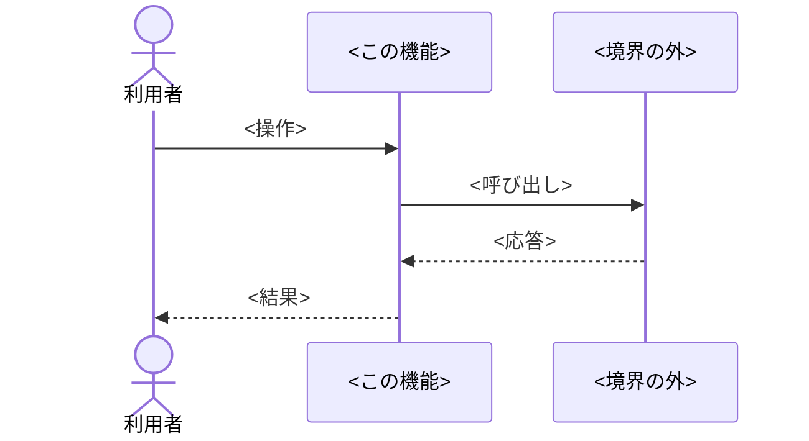

# 設計: <機能名>

## 方針

<!-- どう作るかを3〜5行で。詳細は下の節に置く -->

## 決定と理由

<!--
後から変えるのが高くつく選択だけを書く。ライブラリ選定、外部に出る契約、データの持ち方。
「変えるときの影響」が空欄になる決定は、ここに書くほどの決定ではない。
調べて分かったことは根拠としてここに畳み込む（research.md は作らない）。
-->

| 決定 | 理由 | 却下した案 | 変えるときの影響 |
| ---- | ---- | ---------- | ---------------- |
|      |      |            |                  |

## 構成

### 影響範囲

<!--
この機能で触るファイルをディレクトリツリーで示す。新規/変更/削除のファイルだけを載せ、行末に種別を書く。
他機能と重なっていないかを、ここで目で見て確かめる。
-->

```
<repo-root>/
└── <ディレクトリ>/
    ├── <ファイル>        新規
    └── <ファイル>        変更
```

### ファイルと責務

<!-- 上のツリーのファイルごとの責務 -->

| ファイル | 新規/変更 | 責務 |
| -------- | --------- | ---- |
|          |           |      |

## シーケンス

<!--
主要な流れを Mermaid の sequenceDiagram で書く。利用者の操作から結果までを1本、
それとは別の起点（デプロイ、定期実行など）があれば1本ずつ足す。
参加者は「この機能」と「境界の外（他機能・外部サービス）」が区別できる名前にする。
-->



## 他機能との境界

<!--
この機能が持たないもの、相手に任せるもの。並行開発で衝突しないための宣言。
共有する契約（URL の形、メッセージの形）があれば明記する。
-->

- <相手の機能名>: <どこで切れているか>

## 検証方法

<!--
要件ごとに、何で「できた」と判定するか。tasks.md の _検証:_ 欄はここから引く。
- コマンド: 終了コードで判定できるもの
- Playwright: 回帰させたいもの（テストとしてコードに残す）
- ブラウザ: 見た目や実挙動の初回確認（証拠は残らない）
-->

| 要件 | 検証手段 | 内容 |
| ---- | -------- | ---- |
| 1.1  |          |      |

## リスク

<!-- 実装中に破綻しうる前提。空なら「なし」 -->

- <前提> — <破綻したときにどうするか>

---
<!-- 150行以内。超えたら決定の粒度が細かすぎる -->
