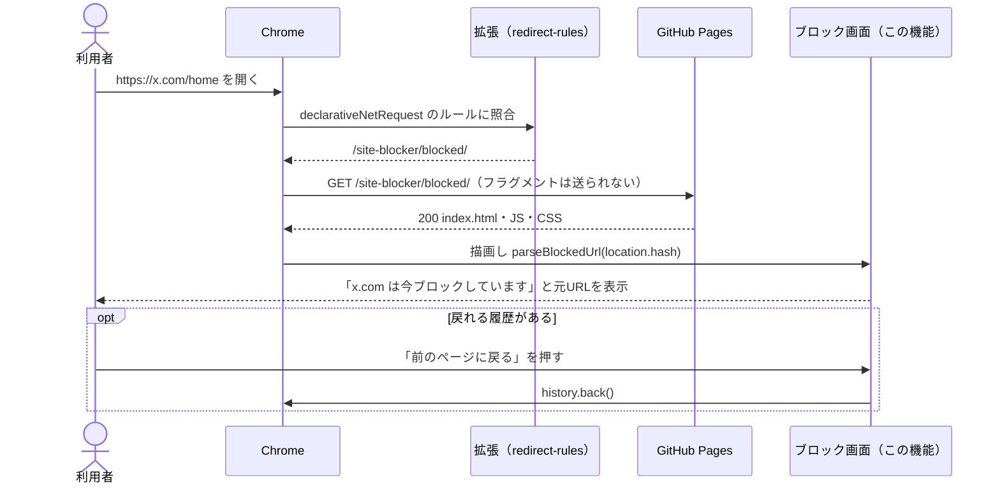
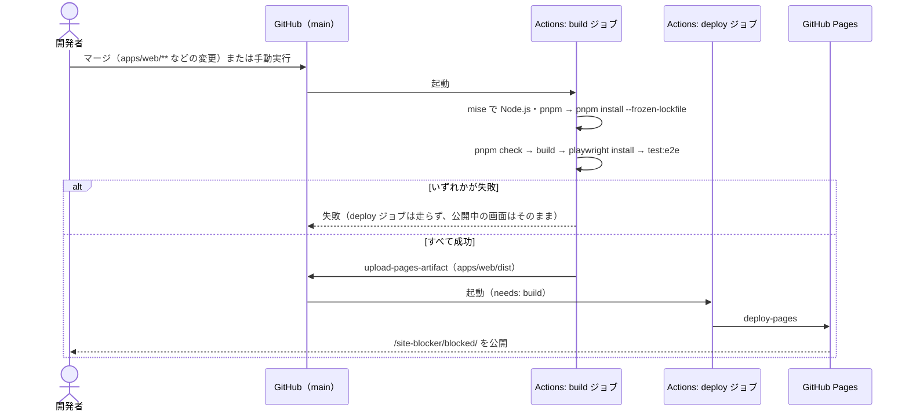

# 設計: blocked-page

## 方針

`apps/web` を Vite のマルチページ構成にし、ブロック画面を `blocked/index.html` として出力する。`base` を `/site-blocker/` にして、ビルド結果をそのまま GitHub Pages に置けば契約どおりの URL になるようにする。
表示は React で、`location.hash` の解釈は純粋関数に切り出して単体テストする。画面全体の挙動（表示・外部送信なし）は Playwright でビルド結果に対して回帰させる。
公開は GitHub Actions の公式 Pages デプロイで行い、ビルド・テストが通ったときだけ公開する。

## 決定と理由

| 決定 | 理由 | 却下した案 | 変えるときの影響 |
| ---- | ---- | ---------- | ---------------- |
| ブロック画面のエントリを `apps/web/blocked/index.html` に置き、Vite の `build.rolldownOptions.input` で指定する（Vite 8 では `rollupOptions` は非推奨）。ルートの `index.html` は置かない | 出力が `dist/blocked/index.html` になり、Pages が `/site-blocker/blocked/` を 301 なしで返す（4.2）。ルートを占有しない（契約） | SPA + ルーター: 1画面のために依存が増え、ルートも占有する / `404.html` へのフォールバック: ステータスが 404 になる / ハッシュルーティング: フラグメントは元URLに使うので衝突する | パスは配布済み拡張に焼き込まれる。変えると古い拡張が壊れる（`guide-tech.md`） |
| Vite の `base` を `/site-blocker/` にする | Pages のサブパスで JS・CSS を絶対パスで参照できる（4.3）。ローカルも同じパスで開けるので、本番とずれない | 相対パス（`base: './'`）: ページが増えたときに階層ごとに参照が変わる | リポジトリ名かカスタムドメインを変えると値が変わる。拡張側の URL も同時に変わる |
| フラグメントの解釈を `parseBlockedUrl(hash)` の純粋関数にし、先頭の `#` を落とすだけでデコードしない | U2 の回答（1.7）。デコードの例外処理も要らない。Chrome は `<` `>` 空白などをフラグメントで `%3C` 等にエンコードして渡すので、そのままの形で表示される。純粋関数なら DOM なしで境界値をテストできる | `decodeURI` で読める形に戻す: U2 で却下（2026-09-24 に見直し） | 表示の仕様だけに効く。拡張側への影響はない |
| 元URLは React の JSX でテキストとして描画し、`dangerouslySetInnerHTML` を使わない | React はテキストを自動でエスケープする（1.3、`guide-tech.md` の Security） | CSP の meta タグで二重に守る: Vite の開発サーバーはインラインスクリプトを挿すので開発時に壊れる。3.x は Playwright で検証する | なし（実装の約束。レビューで見る） |
| フォント・画像・解析スクリプトなど外部リソースを読み込まない。フォントは OS 標準のフォントを使う。favicon は `data:` URI で埋め込む | 元URLは外部に残さない（3.x、`guide-product.md`）。favicon が無いとブラウザがオリジン直下の `/favicon.ico` を取りに行き 404 になる（4.3） | Google Fonts など: 別オリジンへのリクエストになる | 外部リソースを足すときは 3.2 を見直す |
| 公開は `actions/configure-pages` → `actions/upload-pages-artifact` → `actions/deploy-pages` の公式手順で行う。build ジョブで先に `pnpm check` を走らせる | ブランチに成果物をコミットしないで済む。ビルドとデプロイのジョブを分け、検査かビルドが失敗したらデプロイジョブが走らない（4.4）。lint-setup の design で「公開ワークフローから `pnpm check` を呼ぶかは blocked-page で決める」とされていた | `gh-pages` ブランチへ push: 成果物が履歴に残り、書き込み権限が要る | リポジトリの Pages 設定（Source: GitHub Actions）とセットで効く |
| ワークフローは `push`（main、`paths`: `apps/web/**`・ワークフロー自身・`package.json`・`pnpm-lock.yaml`・`pnpm-workspace.yaml`・`mise.toml`）と `workflow_dispatch` で起動する | U3 の回答。ビルド結果に効くのは Web のソースと依存・ツールの版だけなので、それ以外の変更では公開しない（4.1 / 4.6）。手動でも公開できる（4.5） | main への push すべて: 拡張だけの変更でも公開が走る | 依存するファイルを増やしたらパス指定も増やす |
| Node.js と pnpm は `jdx/mise-action` で `mise.toml` から入れる | ローカルと CI のバージョンを1か所で管理する（`guide-tech.md`） | `actions/setup-node` + `pnpm/action-setup`: バージョンを二重に書くことになる | `mise.toml` を上げると CI も上がる |
| E2E は `@playwright/test` を `apps/web` に入れ、`vite preview` で配信したビルド結果に対して走らせる。スクリプトは `test:e2e` として `test` と分ける | ビルド結果で試すので `base` と出力パスも同時に検証できる。`test` と分けるのは、ブラウザを入れていない環境でも `pnpm test` を通すため | 開発サーバーに対して実行: `base` の設定ミスを見逃す / `test` に含める: ルートの一括テストにブラウザが必須になる | E2E を増やすとデプロイの時間が延びる |

## 構成

### 影響範囲

```
site-blocker/
├── .gitignore                          変更
├── .github/workflows/deploy-web.yml    新規
└── apps/web/
    ├── index.html                      削除（blocked/ へ移動）
    ├── blocked/index.html              新規
    ├── e2e/blocked.spec.ts, tsconfig.json  新規
    ├── playwright.config.ts            新規
    ├── package.json                    変更
    ├── vite.config.ts                  変更
    └── src/
        ├── main.tsx                    変更
        ├── App.tsx, App.css            新規
        ├── blockedUrl.ts               新規
        ├── blockedUrl.test.ts          新規
        └── vite-env.d.ts               新規
```

`apps/extension` と、ルートの `package.json` / `pnpm-workspace.yaml` / `mise.toml` には触らない。

### ファイルと責務

| ファイル（`.github/` `.gitignore` 以外は `apps/web/` から） | 新規/変更 | 責務 |
| -------- | --------- | ---- |
| `blocked/index.html` | 新規 | ブロック画面のエントリ。`lang="ja"`、`data:` の favicon |
| `vite.config.ts` | 変更 | `base: "/site-blocker/"`、`input` に `blocked/index.html`。Vitest の対象を `src/**/*.test.*` に絞る（既定では `e2e/*.spec.ts` も拾う） |
| `src/main.tsx`, `src/App.tsx`, `src/App.css` | 変更/新規 | 画面の組み立てと見た目（`light.png` を元にする）。`hashchange` を購読する（1.6） |
| `src/blockedUrl.ts`, `.test.ts` | 新規 | `parseBlockedUrl(hash)`: 表示用URLとホスト名を返す。空なら `null`。Vitest で単体テスト |
| `src/vite-env.d.ts` | 新規 | CSS の import などの型 |
| `e2e/blocked.spec.ts`, `playwright.config.ts` | 新規 | `vite preview` で配信したビルド結果に対する E2E。`e2e/tsconfig.json` で Node の型（Playwright が要求、`@types/node`）を e2e だけに入れ、`typecheck` で両方を検査する |
| `package.json` | 変更 | `dev` / `preview` / `test:e2e` スクリプト、`@playwright/test` |
| `.github/workflows/deploy-web.yml` | 新規 | ビルド・テスト・E2E → Pages へ公開 |
| `.gitignore` | 変更 | Playwright の出力（`test-results/` `playwright-report/`）を無視する |

### 画面の出し分け

| hash | 1行目 | 元URL欄 |
| ---- | ----- | ------- |
| 空、または `#` のみ | 出さない（見出しだけ、U1） | 出さない |
| ホスト名のある URL | 「**<ホスト名>** は今ブロックしています」 | 届いたままの元URL（デコードしない、リンクにしない、1.4 / 1.7） |
| URL として読めない | 「**<元URL>** は今ブロックしています」 | 同上 |

- 戻るボタンは `history.length > 1` のときだけ出す。元URLはリダイレクトで履歴に残らないので、戻ると「ブロック対象を開く前のページ」になる

## シーケンス

### ブロック画面を表示する



### 公開する



- 権限は `contents: read` のみで、`pages: write`・`id-token: write` は deploy ジョブにだけ付ける。`concurrency: pages`、`cancel-in-progress: false` で公開を途中で打ち切らない

## 他機能との境界

- `redirect-rules`: 共有するのは URL の契約（`https://yoshipon-tech.github.io/site-blocker/blocked/#<元URL>`）だけ。この機能はブロック判定を持たず、拡張のコードを import しない。拡張の検証は、この機能で公開した画面を使う
- `monorepo-setup`: ルートの `package.json` と `pnpm-workspace.yaml` は変更しない。`pnpm test` と `pnpm build` の一括実行にそのまま乗る。`.gitignore` への追記だけがリポジトリ直下の変更になる
- ルート（`/site-blocker/`）のページ: この機能では置かない。公開後、ルートは 404 になる

## 検証方法

| 要件 | 検証手段 | 内容 |
| ---- | -------- | ---- |
| 1.1 | Playwright | `#https://www.youtube.com/watch?v=1` で1行目にホスト名 `youtube.com`、元URL欄に元URLが出る |
| 1.2 | コマンド / Playwright | 単体テストで `#https://example.com/a#b` を確認。E2E でも同じ URL が表示される |
| 1.3 | Playwright | `` を含む hash で、文字として表示され `img` 要素が0個 |
| 1.4 / 1.5 | Playwright | 元URL欄の中に `a` 要素がない。見出し（`h1`）の文言が一致する |
| 1.6 | Playwright | 表示後に `location.hash` を変えると元URL欄が追従する |
| 1.7 / 1.9 | コマンド / Playwright | 単体テスト: `%E6%97%A5`・`%26`・不正な `%` が届いたまま。URL として読めないときホスト名が `null`。E2E でも `%E6%97%A5` のまま出る |
| 1.8 | Playwright | 別ページから遷移して開くとボタンが出て、押すと元のページに戻る。直接開くと出ない |
| 2.1 | Playwright | hash なし・`#` のみで見出しが出て、ホスト名の行と元URL欄がない |
| 3.1 / 3.2 | Playwright | 読み込み中の全リクエストを記録し、すべて同一オリジンで、どれも元URLの文字列を含まない |
| 4.1 / 4.5 / 4.6 | コマンド | マージ後と `gh workflow run deploy-web.yml` 後に `gh run list` で成功。`docs/` だけの push で実行が増えない |
| 4.2 | コマンド | 公開後に `curl -sI https://yoshipon-tech.github.io/site-blocker/blocked/` が 200 を返す（301 でない） |
| 4.3 | Playwright / ブラウザ | E2E はビルド結果に対して 4xx のレスポンスが0件。公開後はブラウザのネットワークタブで 404 が0件 |
| 4.4 | コマンド | `pnpm lint:workflows` が通り、`deploy` が `needs: build`、build の最初が `pnpm check` であることをレビューで確認する。故意に失敗させる検証は行わない |
| 見た目 | ブラウザ | `light.png` と見比べる（デスクトップ幅とスマートフォン幅） |

## リスク

- リポジトリの Pages 設定が「GitHub Actions」になっている必要がある。人が一度だけ設定する。**private リポジトリの場合、無料プランでは Pages を使えない** — そのときは公開をやめて人に返す
- 使う Actions は 2026-09-24 に確認した最新メジャー（checkout v7 / configure-pages v6 / upload-pages-artifact v5 / deploy-pages v5 / mise-action v4）に固定する
- Playwright のブラウザのダウンロードで CI が遅くなる — 目に見えて遅くなったら、キャッシュを足すか、E2E を Chromium だけにする（初めから Chromium のみで始める）
