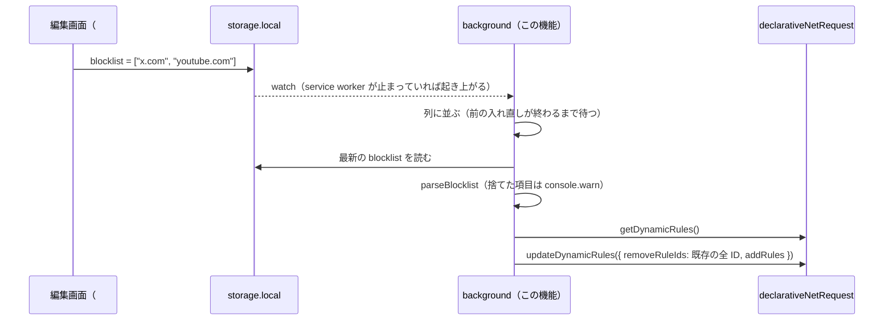
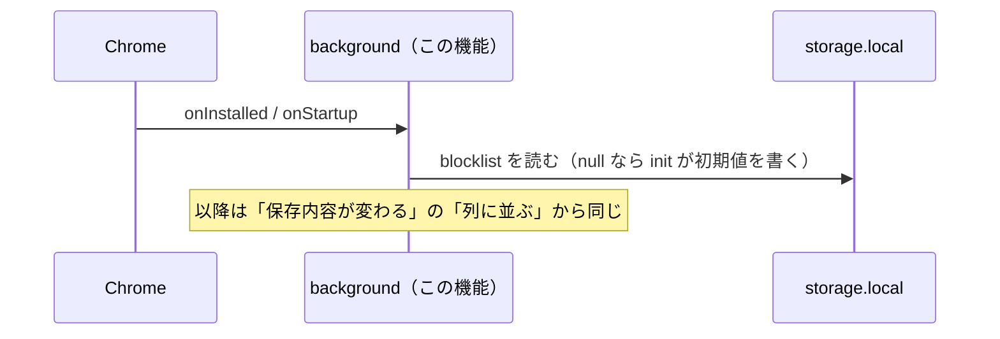

# 設計: blocklist-storage

## 方針

ブロックリストを `browser.storage.local` の `blocklist` キーに、ドメインの文字列の配列として置く。WXT の `storage.defineItem` の `init` で、値がないときだけ初期値（`x.com`・`twitter.com`）を書く。
ルールは「保存内容から全部組み立てて全部入れ直す」を保つ。きっかけを `onInstalled`・`onStartup`・保存内容の変更の3つにし、入れ直しは1本の列に並べて同時に走らせない。
保存内容は読むたびに検査し、ドメインとして扱えない項目は捨てて理由をコンソールに残す。権限は `storage` を足すだけで、`host_permissions` は初期値から生成したまま変えない（U2）。

## 決定と理由

| 決定 | 理由 | 却下した案 | 変えるときの影響 |
| ---- | ---- | ---------- | ---------------- |
| 保存先は `storage.local`、キーは `blocklist`、値は `string[]`（ドメインの配列）。WXT の `version: 1` を付ける | 同期しない（U1）。`local` は容量が 10MB で、書き込み回数の制限がない（[chrome.storage](https://developer.chrome.com/docs/extensions/reference/api/storage)）。`version` を付けておくと、形を変えるときに WXT の `migrations` で起動時に移行できる | `storage.sync`: U1 で不採用 / `{ domain }[]` のオブジェクト配列: サイトごとの属性はまだ何も決まっておらず、必要になれば `migrations` で移せる / IndexedDB: 規模に対して過剰 | **#11 が読み書きする契約。** 形を変えるときは `version` を上げて移行関数を書く |
| 時間帯（#12）や一時解除（#14）の状態は `blocklist` に混ぜず、それぞれ別のキーに置く。`blocklist` を書くのは #11 の編集画面だけ | 書き手が1つなら、別の機能の書き込みで編集内容を上書きし合わない。変わる頻度も違う（一時解除の期限は数分ごと） | 1つのオブジェクトに全部入れる: #11・#12・#14 が同じキーを読み書きし、worktree を分けても同じ型を同時に触る | #12・#14 がこの前提に従って spec を書く |
| 値がないとき（`null`）だけ初期値を書く。WXT の `init` を使う | 空配列は「全部外した」という利用者の意思なので埋め直さない（1.4）。`redirect-rules` の版は storage に何も書いていないので、更新時は「値がない」になり 1.1 と同じ道を通る（1.2）。`getValue()` は `init` の書き込みを待ってから返す（`@wxt-dev/storage` 1.2.9 の実装で確認）ので、初回の入れ直しでも初期値が読める | `onInstalled` の `reason === "install"` で書く: 1.2（更新）で書かれない / 空なら初期値: 1.4 に反する | 初期値を変えても、既に保存済みの利用者には効かない |
| ルールは常に保存内容から全部組み立て、既存を全部外して入れ直す（`syncRules` を流用）。ID は並び順で `1..n` のまま | 部分的に足し引きすると、保存内容とルールがずれたときに戻せない。全部入れ直すなら毎回必ず一致する（2.3 / 2.4）。ID を固定する必要がなくなる | ドメインごとに安定した ID を振り、差分だけ更新する: ID の対応表を別に持つ必要があり、ずれたときの復旧が難しい | #12・#14 は「ルールを直接外す」のではなく「組み立てに渡すリストから除く」形で効かせる（`redirect-rules` の design の「#14 でルールを外す」想定を置き換える） |
| 入れ直しのきっかけは `runtime.onInstalled`・`runtime.onStartup`・`blocklist` の変更（WXT の `watch`）。どれもトップレベルで登録する | `onStartup` で入れ直せば、前回の終了前に追従が終わっていなくても起動時に揃う（2.4）。MV3 の service worker は止まっていても、トップレベルで登録したリスナーのイベントで起き上がる（[service worker のライフサイクル](https://developer.chrome.com/docs/extensions/develop/concepts/service-workers/lifecycle)） | `onStartup` なし: dynamic ルールは残るが、ずれたまま残る場合を拾えない | なし |
| 入れ直しは Promise の列に並べて1つずつ実行し、実行するたびに最新の保存内容を読む | `getDynamicRules` → `updateDynamicRules` の間に別の入れ直しが割り込むと、同じ ID を二重に足して失敗する。最新を読むので、連続して変わっても最後の内容に揃う | 毎回そのまま実行する: 上の競合が起きる / 間引き（debounce）: 待ち時間の分だけ追従が遅れ、テストも待ちが要る | なし |
| 保存内容の検査（`parseBlocklist`）: 配列でなければ空として扱う。項目は小文字の英数字とハイフンのラベルをドットでつないだものだけ通し、重複は最初の1つを残す。捨てた項目と理由を返し、background が `console.warn`（配列でないときは `console.error`）に出す | `requestDomains` は小文字の ASCII しか受け付けず、`updateDynamicRules` は1件でも不正なら全体が失敗する（同ドキュメント）。先に捨てれば残りは登録できる（3.1 / 3.3 / 2.5）。正規化（大文字→小文字など）は入力時の #11 の責務 | 正規化してから通す: 保存内容とブロックの対象がずれ、#11 の画面に出る値と食い違う / 不正があれば全部止める: 1件の誤りでブロックが全部外れる | #11 は、ここで通る形に正規化してから保存する |
| `permissions` に `storage` を足す | `chrome.storage` は `storage` 権限がないと service worker で `undefined` になる（実装時に判明）。`storage` はインストール時の警告を出さない（[権限の一覧](https://developer.chrome.com/docs/extensions/reference/permissions-list)）ので、4.1 の権限の説明は変わらない | なし | なし。警告がないので、配布済み拡張の更新で再承認も求められない |
| 権限のないドメインもルールとして登録する（ブロックはされない） | `declarativeNetRequestWithHostAccess` ではルールの登録自体は通り、一致したときに権限がなければ何もしない。登録を分けなくても残りに影響しない（2.6） | 権限を確かめて登録から外す: #11 が権限を得た直後に入れ直しのきっかけが別に要る | #11 は権限を得ても入れ直しを呼ぶ必要がない（ルールは既にある） |

## 構成

### 影響範囲

```
site-blocker/apps/extension/
├── entrypoints/background.ts        変更
├── tests/background.test.ts         新規
├── vitest.config.ts                 変更（対象に tests/ を足す。entrypoints/ に置くと WXT がエントリとして読む）
├── wxt.config.ts                    変更（storage 権限、初期値の定数名の変更）
├── utils/blocklist.ts               変更
├── utils/blocklist.test.ts          新規
├── utils/storage.ts                 新規
├── utils/storage.test.ts            新規
├── utils/sync.ts                    新規
├── utils/sync.test.ts               新規
└── e2e/
    ├── fixtures.ts                  変更（保存内容を書き換える補助）
    └── storage.spec.ts              新規
```

### ファイルと責務

| ファイル（`apps/extension/` から） | 新規/変更 | 責務 |
| -------- | --------- | ---- |
| `utils/blocklist.ts` | 変更 | `BLOCKLIST` を `DEFAULT_BLOCKLIST` に改名。`parseBlocklist(value: unknown)` → `{ domains, ignored: { value, reason }[], invalidShape }` |
| `utils/blocklist.test.ts` | 新規 | `parseBlocklist` の単体テスト |
| `utils/storage.ts` | 新規 | `blocklistItem = storage.defineItem<string[]>("local:blocklist", { init, version: 1 })`。`wxt.config.ts` から import されないよう `blocklist.ts` と分ける |
| `utils/sync.ts` | 新規 | `createSync(dnr, readBlocklist, log)`: 呼ぶたびに列に並び、最新を読んで検査し `syncRules` する関数を返す |
| `utils/storage.test.ts` | 新規 | `fakeBrowser` で、値がないと初期値が書かれ、既存の値と空配列は上書きされないこと |
| `utils/sync.test.ts` | 新規 | 列に並ぶこと・最新を読むこと・捨てた項目を記録すること・1回の失敗で列が止まらないこと |
| `entrypoints/background.ts` | 変更 | `createSync` を作り、`onInstalled`・`onStartup`・`blocklistItem.watch` から呼ぶ |
| `tests/background.test.ts` | 新規 | 3つのきっかけで入れ直しが呼ばれること（Playwright では `onStartup` が発火しないため） |
| `wxt.config.ts` | 変更 | `permissions` に `storage` を足す。`hostPermissions(DEFAULT_BLOCKLIST)` |
| `e2e/fixtures.ts` | 変更 | `setBlocklist(worker, value)`: service worker の中で `chrome.storage.local.set({ blocklist: value })` |
| `e2e/storage.spec.ts` | 新規 | 1.x・2.x・3.x を拡張を読み込んだ Chromium で確かめる |

`utils/rules.ts`（`buildRules`・`syncRules`）と既存の `e2e/redirect.spec.ts` は変えない。

## シーケンス

### 保存内容が変わる



### インストール・更新・起動



## 他機能との境界

- `redirect-rules`: `buildRules`・`syncRules`・`hostPermissions` とリダイレクト先の URL の契約はそのまま使い、変えない
- `blocklist-ui`（#11）: `blocklist` キーの唯一の書き手。`parseBlocklist` が通す形（小文字のドメイン）に正規化してから保存し、足したサイトの権限を `optional_host_permissions` と `permissions.request` で求める。保存すれば入れ直しはこの機能が行う
- `schedule-blocking`（#12）・`temporary-unblock-extension`（#14）: 状態は別のキーに置き、組み立てに渡すリストから除く形で効かせる。入れ直しの列（`createSync`）に読み込む値を足す形で拡張する

## 検証方法

| 要件 | 検証手段 | 内容 |
| ---- | -------- | ---- |
| 1.1 | Playwright | 新しいプロファイルで起動すると `blocklist` が `["x.com", "twitter.com"]` で、x.com がブロックされる |
| 1.2 | コマンド | 単体テスト: 値がない状態で読むと初期値が書かれる。`syncRules` が既存のルール（旧版の ID 1・2）を外して入れ直す（既存テスト） |
| 1.3 / 1.4 | コマンド | 単体テスト（`fakeBrowser`）: 既存の `["x.com"]` と `[]` を `init` が上書きしない |
| 1.3 / 1.4 | Playwright | `blocklist` を `["x.com"]`・`[]` にして同じプロファイルで起動し直すと、値が保たれ、ルールがそれぞれ1件・0件 |
| 2.1 / 2.2 | Playwright | `twitter.com` を外すと twitter.com が開け、戻すと再びブロックされる |
| 2.3 | コマンド | 単体テスト: 続けて3回呼ぶと実行が重ならず、最後の内容に揃う |
| 2.4 | Playwright | 起動中に dynamic ルールだけを全部外してから閉じ、同じプロファイルで起動し直すと、保存内容どおりのルールに戻る（Playwright では起動のたびに `onInstalled` が発火する） |
| 2.4 | コマンド | 単体テスト（`tests/background.test.ts`）: `fakeBrowser` で `onStartup`・`onInstalled`・保存内容の変更を起こすと入れ直しが呼ばれる |
| 2.5 / 3.1 / 3.3 | コマンド | 単体テスト: `parseBlocklist` が重複・空文字・`https://x.com`・`x.com/a`・`X.com`・配列でない値を正しく扱う |
| 2.5 / 2.6 / 3.1 | Playwright | `["x.com", "x.com", "X.com", "example.com"]` を保存すると、ルールが2件（x.com・example.com）で、x.com はブロック、example.com（権限なし）はブロックされない |
| 3.2 | コマンド | 単体テスト: 捨てた項目と理由が `log` に渡る |
| 3.2 | ブラウザ | chrome-devtools MCP で拡張を読み込み、不正な値を保存して、service worker のコンソールに項目と理由が出ることを確かめる |
| 4.1 | コマンド | 既存の `test:e2e`（`redirect.spec.ts`）が変更なしで通る。ビルドした `manifest.json` の `permissions` が `declarativeNetRequestWithHostAccess`・`storage` のみで、`host_permissions` が変わっていない |
| 5.1 | コマンド | `parseBlocklist` の検査と列の直列化をそれぞれ一時的に壊すと、単体テストか `test:e2e` が失敗し、戻すと通る |

## リスク

- 権限のないドメインのルールが `updateDynamicRules` で拒否される — 拒否されたら、`permissions.contains` で権限のあるドメインだけを登録する形に変え、#11 との境界（権限を得たら入れ直す）を見直す
- `chrome.storage.local.set` を service worker の中から呼ぶと、同じ worker の `watch` が発火しない — `storage.onChanged` は書いた本人にも届く仕様だが、届かなければ E2E では拡張のページ（`chrome-extension://<id>/` の空ページ）から書き込む
