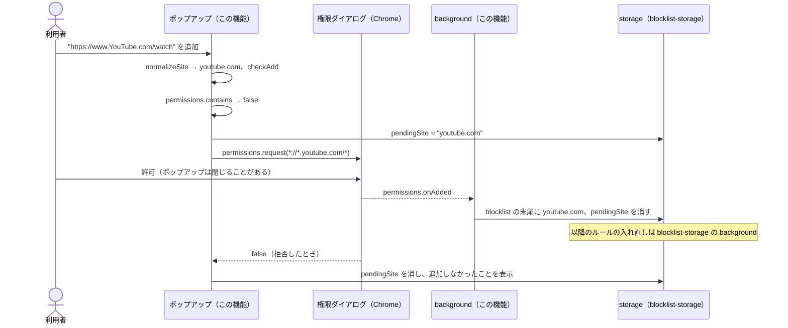

# 設計: blocklist-ui

## 方針

WXT の `popup` エントリとして、ツールバーのアイコンから開くポップアップを足す。画面は React を使わず DOM を直接組み立て、値はすべて `textContent` で出す。
ポップアップは `blocklist`（`blocklist-storage` の `blocklistItem`）を読み書きするだけで、ルールの入れ直しは既存の background に任せる。
権限を求めないと足せないサイトは、許可された時点で background が `permissions.onAdded` を受けて保存する。ポップアップが権限ダイアログで閉じても追加が失われないようにするため。
入力の正規化・一覧の操作・権限との段取りは `chrome` を直接触らない関数に分け、Vitest で確かめる。

## 決定と理由

| 決定 | 理由 | 却下した案 | 変えるときの影響 |
| ---- | ---- | ---------- | ---------------- |
| `optional_host_permissions: ["*://*/*"]` を足し、追加のたびに `permissions.request({ origins: ["*://*.<ドメイン>/*"] })` を求める。`host_permissions`（初期値の2サイト）は変えない | 任意の権限はインストール時の警告に出ない（[permissions API](https://developer.chrome.com/docs/extensions/reference/api/permissions)）ので 4.1 を満たす。求めるのは入力したサイトのパターンだけ（4.2）。パターンは既存の `hostPermissions` で作り、ルールの `requestDomains`（サブドメインを含む）と範囲を揃える | `host_permissions: ["*://*/*"]`: インストール時に全サイトの警告が出る（4.1 に反する、`redirect-rules` の U3） | 配布後に `optional_host_permissions` を狭めると、利用者が既に許可したサイトの扱いが変わる |
| 権限が要る追加は2段にする。ポップアップが `storage.session` の `pendingSite` に追加したいドメインを書いてから `permissions.request` を呼び、background が `permissions.onAdded` で `pendingSite` と一致するパターンを受けたら `blocklist` の末尾に足して `pendingSite` を消す | Chrome でポップアップから権限ダイアログを出すと、許可したときにポップアップが閉じ、結果を受け取る前にスクリプトが止まるという報告がある（[w3c/webextensions#657](https://github.com/w3c/webextensions/issues/657) の議論）。background なら閉じない。`storage.session` はブラウザを閉じると消えるので、拒否されて残った `pendingSite` も持ち越さない | ポップアップで `request` の結果を待って保存する: 閉じたら追加が失われる / オプションページに出す: U1 でポップアップに決定 | `blocklist` の書き手がポップアップと background の2つになる（どちらもこの機能）。`blocklist-storage` の「書き手は編集画面だけ」をこの機能の中の2箇所と読み替える |
| 既に権限を持つサイト（初期値の2サイトなど）は、`permissions.contains` で確かめてダイアログを出さずにポップアップが直接保存する | 持っている権限を `request` しても `onAdded` は発火しないので、2段の経路では保存されない。E2E で権限ダイアログなしに追加を確かめられる経路にもなる | 常に `request` する: 上の理由で保存されない | なし |
| 削除したサイトのパターンが manifest の `host_permissions` に含まれないときだけ `permissions.remove` で手放す（3.4） | `host_permissions` の権限は外せず、`remove` は失敗する（同ドキュメント）。`runtime.getManifest()` で判定すれば初期値をコードに重複して書かずに済む | 常に `remove` して失敗を無視する: 失敗が正常系に紛れ、本当の失敗に気づけない | なし |
| 入力の正規化は `new URL()` に任せる。スキームがなければ `https://` を前に付けて解釈し、`hostname`（小文字化・国際化ドメインの punycode 化済み）を取り、先頭の `www.` を1つ外し、`parseBlocklist` と同じドメインの検査を通す | 2.4〜2.7 を自前の文字列処理なしで満たせる。保存する値が `blocklist-storage` の `parseBlocklist` で必ず通る形になる | 正規表現で URL を切り出す: ポート・認証情報・国際化ドメインの扱いを自前で持つことになる | 正規化を変えても既存の保存内容は変わらない |
| 一覧の上限は有効なドメインで 1,000 件 | ルールは `regexFilter` を使うので正規表現ルールとして数えられ、上限が 1,000 件（`guide-tech.md`）。超えると `updateDynamicRules` 全体が失敗し、全サイトのブロックが外れる | 5,000 件（dynamic ルール全体の上限）: 正規表現ルールの上限で先に失敗する | ルールの組み立てが `regexFilter` を使わなくなれば上げられる |
| 画面は React を使わず、`main.ts` で DOM を組み立てる | 入力欄・ボタン・一覧だけの画面で、依存を増やさずに済む。`apps/web` の React とはコードを共有しない（`guide-structure.md`）ので揃える利点がない | React（`@wxt-dev/module-react`）: この規模では依存と設定が増えるだけ | 画面が育ったら React に移す。ロジックは `utils/` にあるので移しやすい |

## 構成

### 影響範囲

```
site-blocker/apps/extension/
├── wxt.config.ts                    変更（optional_host_permissions）
├── entrypoints/
│   ├── background.ts                変更（permissions.onAdded）
│   └── popup/
│       ├── index.html               新規
│       ├── main.ts                  新規
│       └── style.css                新規
├── utils/
│   ├── blocklist.ts                 変更（isDomain を公開）
│   ├── storage.ts                   変更（pendingSiteItem、書き手の説明）
│   ├── site.ts                      新規
│   ├── site.test.ts                 新規
│   ├── editor.ts                    新規
│   └── editor.test.ts               新規
├── tests/background.test.ts         変更
└── e2e/
    ├── fixtures.ts                  変更（ポップアップを開く補助）
    └── popup.spec.ts                新規
```

### ファイルと責務

| ファイル（`apps/extension/` から） | 新規/変更 | 責務 |
| -------- | --------- | ---- |
| `utils/blocklist.ts` | 変更 | ドメインの検査を `isDomain(value)` として公開し、`parseBlocklist` もそれを使う |
| `utils/site.ts` | 新規 | `normalizeSite(input)` → ドメイン or 理由。`checkAdd(stored, domain)` → 可否と理由（重複・サブドメイン・上限）。`describeEntries(stored)` → 表示用の行（有効 / 無効、保存順） |
| `utils/editor.ts` | 新規 | `addSite(input, deps)`・`removeEntry(entry, deps)`・`completePendingSite(origins, deps)`。`deps` に `permissions`・保存先・manifest を受け取る |
| `utils/storage.ts` | 変更 | `pendingSiteItem`（`session:pendingSite`、`string \| null`）を足す |
| `entrypoints/popup/main.ts` | 新規 | 一覧と入力欄を描き、`blocklistItem.watch` と `permissions.onAdded/onRemoved` で描き直す。結果の文言を表示する |
| `entrypoints/background.ts` | 変更 | `permissions.onAdded` をトップレベルで登録し、`completePendingSite` を呼ぶ |
| `wxt.config.ts` | 変更 | `optional_host_permissions: ["*://*/*"]` |
| `e2e/fixtures.ts` | 変更 | `openPopup(context, worker)`: service worker の URL から拡張の ID を取り、`popup.html` をタブで開く |
| `e2e/popup.spec.ts` | 新規 | 権限ダイアログが出ない範囲の 1.x・2.x・3.x |

## シーケンス

### 権限を持たないサイトを足す



権限を持つサイトは `pendingSite` と `request` を通らず、ポップアップが直接 `blocklist` に足す。削除はポップアップが `blocklist` から外し、3.4 に当たれば `permissions.remove` を呼ぶ。

## 他機能との境界

- `blocklist-storage`: `blocklist` の形（小文字のドメインの配列）・`parseBlocklist`・入れ直しの列は変えずに使う。保存すれば入れ直しはそちらが行う。`isDomain` の切り出しは検査の中身を変えない
- `redirect-rules`: `hostPermissions` を権限のパターンとして使う。ルールの組み立てとリダイレクト先の URL の契約には触らない
- `schedule-blocking`（#12）・`temporary-unblock-extension`（#14）: ポップアップに状態を足す場合も `blocklist` には書かず、それぞれのキーを読む

## 検証方法

| 要件 | 検証手段 | 内容 |
| ---- | -------- | ---- |
| 1.1 / 1.2 | Playwright | ポップアップに初期値の2サイトが保存順に出る。`[]` を保存すると1件もないことが出る |
| 1.3 | Playwright | ポップアップを開いたまま service worker から `blocklist` を書き換えると、表示が変わる |
| 1.4 | Playwright | `["x.com", "example.com"]` を保存すると、example.com の行にだけブロックされていない旨が出る |
| 1.5 | Playwright | `["x.com", "X.com", 1]` を保存すると無効の行が2つ出て、削除すると `blocklist` から消える |
| 2.1 / 2.3 | コマンド | 単体テスト（偽の `permissions`）: 許可されると `pendingSite` が書かれ `request` が呼ばれる / 拒否されると `blocklist` が変わらず `pendingSite` が消える / `completePendingSite` が一致するパターンでだけ末尾に足す |
| 2.1 / 2.3 | ブラウザ | 人が手元の Chrome で youtube.com を追加し、許可で一覧に足されブロックされる、拒否で足されないことを確かめる（権限ダイアログは自動で押せない） |
| 2.2 / 3.1 / 3.2 / 3.3 | Playwright | twitter.com を削除すると開け、ポップアップから `Twitter.com` で足し直すとブロックされる（権限を持つのでダイアログなし）。最後の1件まで消すと `[]` が保存される |
| 2.4〜2.9 | コマンド | 単体テスト: `normalizeSite`・`checkAdd` が大文字・URL・`www.`・空・不正・重複・サブドメイン・1,000 件を扱う |
| 2.4〜2.9 | Playwright | 空・`https://`・`www.x.com` を入力すると、保存されず理由が出る |
| 3.4 | コマンド | 単体テスト: manifest の `host_permissions` にないパターンだけ `permissions.remove` が呼ばれる |
| 4.1 / 4.2 | コマンド | ビルドした `manifest.json` の `permissions`・`host_permissions` が変わらず、`optional_host_permissions` だけが増える。単体テストで `request` に渡す `origins` が入力したサイトの1件だけ |
| 5.1 | コマンド | `normalizeSite` の `www.` 除去と `checkAdd` の重複検査をそれぞれ一時的に壊すと、単体テストか `test:e2e` が失敗し、戻すと通る |

## リスク

- ポップアップを `popup.html` としてタブで開いた E2E は、本物のポップアップと寸法・閉じ方が違う — 見た目はブラウザでの確認で補う
- 権限を許可してもポップアップが閉じず、`request` が `true` を返す場合もある — 保存は background に一本化しているので、ポップアップは `watch` で描き直すだけにし、二重に足さない
- 利用者が Chrome の設定からサイトのアクセスを変えると、`pendingSite` と無関係に `onAdded` が発火する — `pendingSite` と一致しないパターンは無視する
