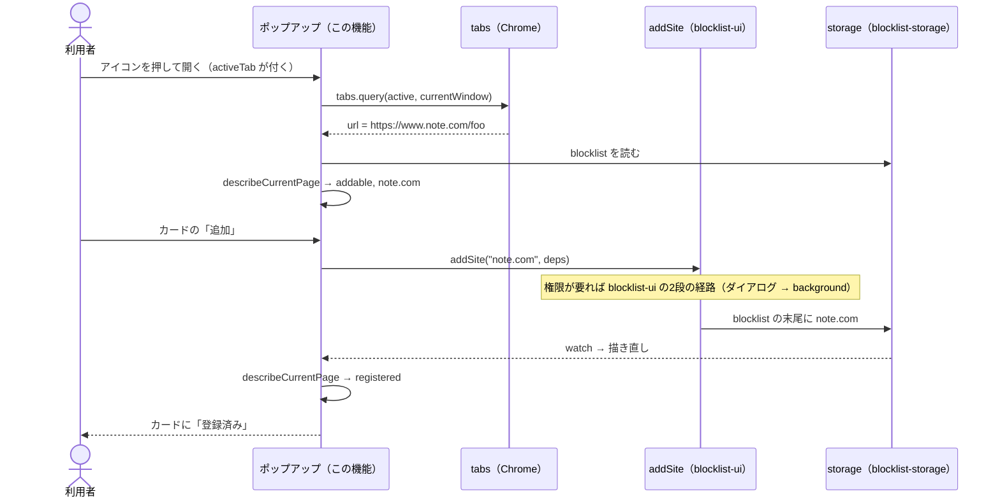

# 設計: current-tab-add

## 方針

`blocklist-ui` のポップアップに「今開いているページ」のカードを足す。見た目は `mock-addable.png` と既存の Dawn のスタイルに従う。
ポップアップを開いたときに `tabs.query` で今のタブの URL を1回だけ読み、`activeTab` 権限で URL を読めるようにする。
カードの状態（追加できる / 登録済み / 追加できない）は、URL と保存内容から決める `chrome` を使わない関数に切り出し、Vitest で確かめる。
カードの「追加」は、入力欄からの追加と同じ `addSite` に、カードのドメインを渡して呼ぶ。権限・重複・上限の扱いを1つの経路に揃える。

## 決定と理由

| 決定 | 理由 | 却下した案 | 変えるときの影響 |
| ---- | ---- | ---------- | ---------------- |
| `permissions` に `activeTab` を足し、ポップアップで `tabs.query({ active: true, currentWindow: true })` の `url` を読む | `activeTab` はインストール時の警告を出さず（4.1）、ツールバーのアイコンを押したときだけ、そのタブの URL を読めるようにする（4.2）（[Declare permissions and warn users](https://developer.chrome.com/docs/extensions/mv2/permission-warnings)・[Protect user privacy](https://developer.chrome.com/docs/extensions/mv3/user_privacy)） | `tabs` 権限: 「閲覧履歴の読み取り」の警告が出て 4.1 に反する / `host_permissions: ["*://*/*"]`: 全サイトの警告が出る | 外すと、権限を持たないサイトの URL が読めなくなり、カードはいつも「追加できない」になる |
| カードの状態は `describeCurrentPage(url, stored)` が返す。`url` が読めない・`http(s)` 以外・ブロック画面（`BLOCKED_PAGE_URL` で始まる）なら「追加できない」。それ以外は `normalizeSite(url)` のドメインがブロックリストのサイトそのものかサブドメインなら「登録済み」、そうでなければ「追加できる」 | 1.2 の規則を入力欄と同じ `normalizeSite` で満たせる。「登録済み」の判定は `checkAdd` の重複・サブドメインの判定と同じでなければならないので、`checkAdd` からその判定を `coveringDomain(domains, domain)` として切り出し、両方で使う | `checkAdd` をそのまま使い、失敗なら「登録済み」にする: 上限に達したときも「登録済み」と出てしまう | なし |
| 上限（1,000 件）はカードの状態にせず、押したときに `addSite` の理由として出す | 入力欄と同じ結果にする（2.1）。上限はめったに起きず、カードの状態を増やすほどではない | 上限ならカードを「追加できない」にする: 状態が増え、理由も別の書き方になる | なし |
| カードは開いたときの URL を覚えておき、`blocklistItem.watch` と権限の変化で一覧と一緒に描き直す | 追加した直後に「登録済み」へ変わる（2.2）。カードから追加したときの保存が background 経由（権限を求めたとき）でも同じ経路で変わる | 追加の結果を受けてカードだけを変える: 権限ダイアログでポップアップが閉じる経路と別になる | なし |
| カードの追加ボタンのアクセシブルな名前を `<ドメイン> を追加` にする | 見た目はモックどおり「追加」（U3）。入力欄の「追加」と、支援技術や E2E の locator で区別できる | 名前も「追加」: 既存の E2E（`exact: true` の「追加」）が2つに当たって壊れる | なし |

## 構成

### 影響範囲

```
site-blocker/apps/extension/
├── wxt.config.ts                    変更（activeTab）
├── entrypoints/popup/
│   ├── index.html                   変更（カード）
│   ├── main.ts                      変更（今のタブを読み、カードを描く）
│   └── style.css                    変更（カード）
└── utils/
    ├── site.ts                      変更（describeCurrentPage・coveringDomain）
    └── site.test.ts                 変更
```

### ファイルと責務

| ファイル（`apps/extension/` から） | 新規/変更 | 責務 |
| -------- | --------- | ---- |
| `wxt.config.ts` | 変更 | `permissions` に `activeTab`。コメントで警告が出ないことを書く |
| `utils/site.ts` | 変更 | `coveringDomain(domains, domain)` → 一致する登録済みのドメイン or `undefined`（`checkAdd` も使う）。`describeCurrentPage(url, stored)` → `{ kind: "addable" \| "registered", domain }` か `{ kind: "unavailable" }` |
| `utils/site.test.ts` | 変更 | `describeCurrentPage` の各状態（`www.`・大文字・サブドメインの登録済み・`chrome://`・`undefined`・ブロック画面）。`checkAdd` の既存テストはそのまま通す |
| `entrypoints/popup/index.html` | 変更 | 入力欄の上にカードの枠（「今開いているページ」・サイト名・追加ボタン・状態の文言） |
| `entrypoints/popup/main.ts` | 変更 | 開いたときに今のタブの URL を読む。`render` でカードも描き、追加ボタンで `addSite(domain, deps)` を呼ぶ。サイト名は `textContent` で出す |
| `entrypoints/popup/style.css` | 変更 | カード（白い面・角丸・塗りの追加ボタン）と、入力欄側の枠線の追加ボタン |

## シーケンス



## 他機能との境界

- `blocklist-ui`: `addSite`・`normalizeSite`・一覧・削除は振る舞いを変えずに使う。`checkAdd` は判定の一部を関数に切り出すだけで、返す理由は変えない
- `blocklist-storage`: `blocklist` の形と、保存したあとの入れ直しは変えない
- `redirect-rules`: ルールとブロック画面の URL の契約には触らない。ブロック画面かどうかは `BLOCKED_PAGE_URL` で判定する
- `service-worker-cleanup`: background には触らない。カードから追加したサイトの service worker は、既存の保存内容の変更のきっかけで取り除かれる

## 検証方法

| 要件 | 検証手段 | 内容 |
| ---- | -------- | ---- |
| 1.2 / 1.4 / 1.5 | コマンド | 単体テスト: `describeCurrentPage` が `https://www.Note.com/foo` → addable `note.com`、`news.x.com`（`["x.com"]`）→ registered、`chrome://newtab/`・`undefined`・ブロック画面の URL → unavailable を返す |
| 1.1 / 1.3 / 2.1 / 2.2 / 2.3 | ブラウザ | 人が `dev` で起動した Chrome で、権限を持たない note.com を開いてポップアップを開くと、入力欄の上のカードに `note.com` と追加ボタンが出て、見た目がモックと揃っている。押して許可すると一覧に足され、もう一度開くとカードが「登録済み」で、note.com のタブは移っていない。拒否すると足されない。ブロックリストから外した x.com（権限を持つ）ではダイアログなしに足され、開いたまま「登録済み」に変わる |
| 1.4 / 1.5 | ブラウザ | 上と同じ Chrome で、`www.x.com` のタブ（追加前から開いていたもの）では「登録済み」、新しいタブ・`chrome://extensions`・ブロック画面では「追加できない」が出て、どちらも追加ボタンが出ない |
| 3.1 | Playwright | 既存の `e2e/popup.spec.ts`（`pnpm --filter @site-blocker/extension run test:e2e`）がそのまま通る |
| 4.1 / 4.2 | コマンド | ビルドした `manifest.json` の `permissions` に `activeTab` だけが増え、`host_permissions`・`optional_host_permissions` は変わらない。`tabs.query` を呼ぶのが `entrypoints/popup/` だけであることを `grep` で確かめる |
| 5.1 | コマンド | `describeCurrentPage` の登録済みの判定と `www.` の扱いをそれぞれ一時的に壊すと `test` が失敗し、戻すと通る |

## リスク

- カードの表示と追加の操作は自動テストを持たない（人の判断で E2E は作らない）。ポップアップの描画を後から変えると、カードが壊れても自動では気づけない — 判定は `describeCurrentPage` に寄せ、`main.ts` には描画と `addSite` の呼び出しだけを置いて、壊れうる範囲を小さくする
- 既存の E2E はポップアップを `popup.html` としてタブで開くので、カードは「追加できない」で出る — 既存のテストはカードに触れないので影響しない。カードのボタンの名前を入力欄の「追加」と分けておく（決定と理由）
