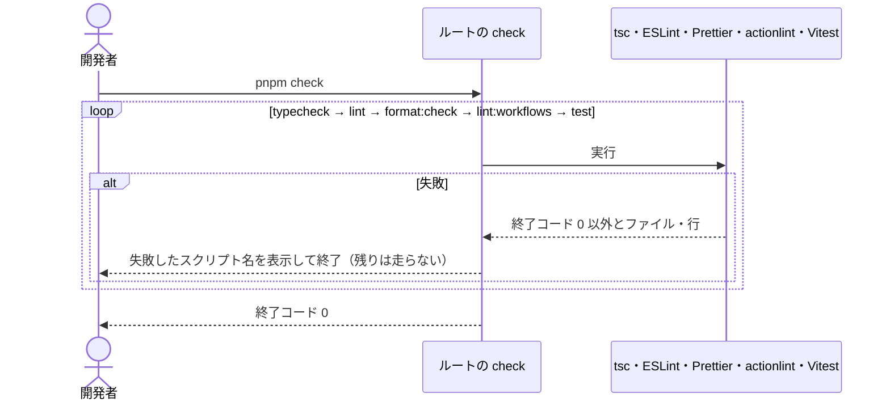
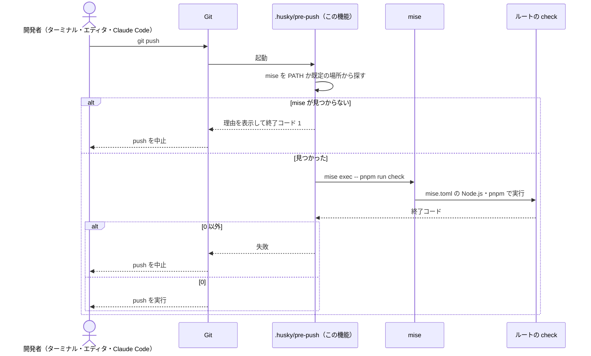

# 設計: lint-setup

## 方針

typescript-eslint が TypeScript 7 に未対応なので、全アプリの TypeScript を 6 系に揃える。
型チェックは各アプリの `tsc --noEmit` で行い、lint・フォーマット・ワークフロー検査はリポジトリ直下に1つずつ設定を置いて全体に掛ける。
これらとテストをまとめた `pnpm check` をルートに用意し、husky の `pre-push` から mise 経由で呼ぶ。

## 決定と理由

| 決定 | 理由 | 却下した案 | 変えるときの影響 |
| ---- | ---- | ---------- | ---------------- |
| lint は ESLint 10 + typescript-eslint 8 + eslint-plugin-react-hooks 7。設定はルートの `eslint.config.js`（flat config）1つ | 人から ESLint を指定された。react-hooks の公式ルール（2.3）が使える。設定を1つにすると両アプリの規則が揃う | Biome / oxlint: TypeScript に依存せず速いが、指定と異なる / アプリごとに設定: 規則が揃わない | 規則を変えると全ファイルの違反が一度に変わる |
| TypeScript を全アプリで `~6.0.3` に下げ、ルートにも同じ版を入れる | typescript-eslint 8.70 の peer は `typescript >=4.8.4 <6.1.0`（`npm view typescript-eslint peerDependencies` で確認）。TypeScript 7 は従来の JS API（`createSourceFile` など）を公開しておらず、`unstable/*` だけを出す。WXT の peer は `>=5.4`、Vite・Vitest・React プラグインは TypeScript に制約がないので、6 系で動く。版が1つなら lint と `tsc` の型解析が一致する | ESLint 用にだけルートに 6 系を置き、アプリは 7 系: 版が2つになり、型情報付き lint の結果が `tsc` とずれうる / lint を諦める: 指定と異なる | typescript-eslint が 7 系に対応したら、全体を 7 系に上げる（`guide-tech.md` に明記する） |
| 型情報を使う lint ルール（`recommendedTypeChecked`）を使う。型情報は `parserOptions.projectService` で各アプリの `tsconfig.json` から得る。tsconfig に含まれない設定ファイル（`*.config.*`）は型情報なしのルールに落とす | `await` の付け忘れ（`no-floating-promises`）など、型がないと見つからない誤りを拾える。`redirect-rules` の `chrome.*` の非同期 API で効く。コード量が小さいので push 時の遅さは問題にならない | `recommended` のみ: 上記を見逃す / `strictTypeChecked`: 最初から厳しすぎ、既存コードの修正が増える | ルールを緩めると、見逃しが増える |
| Web の `tsconfig.json` に `strict: true` を足す。拡張は WXT の生成設定（すでに `strict`）を使う | 1.3（暗黙の any、null の見落とし）を型の誤りにするため | `noImplicitAny` と `strictNullChecks` だけ: 部分的に有効にする理由がない | 後から緩めるとコードの前提が崩れる |
| フォーマットは Prettier 3。設定は既定値のまま（ダブルクォート、セミコロン、末尾カンマ）。`.prettierignore` で `*.md`・成果物・lockfile を外す | 既存コードの書式が既定値と一致しているので、差分が最小になる。Markdown を外す（3.4） | Biome のフォーマッタ: ESLint と2つの系統になる | 設定を変えると全ファイルが一度に書き換わる |
| ESLint の最後に `eslint-config-prettier` を置く | 書式に関わる lint ルールを切り、Prettier と衝突させない（3.3） | 書式を ESLint のルールで揃える（`eslint-plugin-prettier`）: 遅く、出力が読みにくい | なし |
| ワークフロー検査は actionlint。バージョンは `mise.toml` で固定し、shellcheck も同じく固定する | `mise ls-remote actionlint` で入れられる（1.7.12）。shellcheck があると `run:` のシェルも検査される。ローカルと将来の CI で同じ版になる（4.2） | brew で各自が入れる: 版が揃わない / npm のラッパー: 公式ではない | `mise.toml` を上げると検査結果が変わりうる |
| 一括チェックはルートの `check` スクリプトで、`typecheck → lint → format:check → lint:workflows → test` の順に `&&` でつなぐ | 失敗したスクリプト名を pnpm が表示する（5.2）。速いものから並べ、失敗を早く返す | `npm-run-all2` で失敗しても全部走らせる: 依存が増える。push を止める用途では最初の失敗で足りる | 順序だけの話で、変えても影響は小さい |
| push 前のフックは husky 9 の `pre-push`。ルートの `prepare` スクリプトで `husky` を実行して有効にする | `pnpm install` だけでフックが有効になる（6.3） | lefthook: mise で入れられるが、人から husky を指定された / `.git/hooks` を手で置く: クローンごとに手作業が要る | フックを消すと push 前の検査がなくなる |
| フックの中では `mise exec -- pnpm run check` を呼ぶ。`mise` が PATH にないときは、既定のインストール先（`/opt/homebrew/bin`、`~/.local/bin`）を PATH に足してから探し、それでも見つからなければ理由を表示して失敗する | エディタの Git 画面は mise を有効化したシェルを通らないので、PATH に Node.js・pnpm がない（6.4） | PATH を前提にして `pnpm run check` だけ呼ぶ: 上記で失敗する / 見つからなければ検査を飛ばす: 検査なしで push される | mise をやめると、フックの書き方も変わる |

## 構成

### 影響範囲

```
site-blocker/
├── package.json                  変更（scripts・devDependencies）
├── pnpm-lock.yaml                変更
├── mise.toml                     変更（actionlint・shellcheck）
├── eslint.config.js              新規
├── .prettierrc.json              新規
├── .prettierignore               新規
├── .husky/pre-push               新規
├── .claude/rules/
│   ├── rule-git.md               変更
│   └── guide-tech.md             変更
└── apps/
    ├── web/package.json          変更（typecheck・TypeScript 6）
    ├── web/tsconfig.json         変更（strict）
    ├── extension/package.json    変更（typecheck・TypeScript 6）
    └── */ 既存ソース             変更（検査を通すための修正があれば）
```

### ファイルと責務

| ファイル | 新規/変更 | 責務 |
| -------- | --------- | ---- |
| `package.json` | 変更 | `typecheck`（`pnpm -r run typecheck`）・`lint`（`eslint .`）・`format` / `format:check`・`lint:workflows`（`actionlint`）・`check`・`prepare`（`husky`）。ESLint・Prettier・husky・TypeScript 6 |
| `apps/*/package.json` | 変更 | `typecheck`（`tsc --noEmit`）。`typescript` を `~6.0.3` に |
| `eslint.config.js` | 新規 | 無視（`**/dist` `**/.output` `**/.wxt` など、2.4）→ JS 推奨 → typescript-eslint 推奨 → `apps/web/**` に react-hooks → 最後に prettier |
| `.prettierrc.json` / `.prettierignore` | 新規 | 既定値の明示 / `*.md`・成果物・`pnpm-lock.yaml` を対象外にする |
| `.husky/pre-push` | 新規 | mise を探し、`mise exec -- pnpm run check` を実行する |
| `mise.toml` | 変更 | `actionlint`・`shellcheck` のバージョン固定 |
| `rule-git.md` | 変更 | 「機械的な強制」の行を、push 前の一括チェックあり・commitlint と CI はなし、に書き換える（6.5） |
| `guide-tech.md` | 変更 | Core Technologies に「TypeScript 6 系（typescript-eslint が 7 系に対応したら上げる）」、Common Commands に `pnpm check` などを足す |

## シーケンス

### 一括チェック



### push 前の自動実行



## 他機能との境界

- `monorepo-setup`: ルートの `build` / `test` スクリプトと workspace 定義はそのまま使い、変えない
- `blocked-page`（`feat/blocked-page` ブランチ）: この機能を main に入れたあとで取り込み直す。`apps/web/package.json` の scripts が衝突するので手で解消し、blocked-page のコードも `pnpm check` を通す。公開ワークフローから `pnpm check` を呼ぶかは blocked-page の tasks で決める
- `redirect-rules`: まだ始まっていない。この機能のあとに分岐すれば衝突しない

## 検証方法

| 要件 | 検証手段 | 内容 |
| ---- | -------- | ---- |
| 1.1 / 1.4 | コマンド | `pnpm typecheck` が終了コード 0。`pnpm --filter @site-blocker/web run typecheck` で web だけが走る |
| 1.2 / 1.3 | コマンド | 一時ファイルに `function f(x) { return x.y }` と `document.getElementById("a").id` を置くと終了コード 0 以外で、ファイル名と行が出る。確認後に消す |
| 2.1 / 2.2 | コマンド | `pnpm lint` が終了コード 0。一時的に未使用変数を置くと、ルール名付きで失敗する |
| 2.3 | コマンド | 一時的に条件分岐の中で `useState` を呼ぶ・`useEffect` の依存を漏らすと、`react-hooks/*` で失敗する |
| 2.4 | コマンド | ビルド後に `pnpm lint` が終了コード 0（`dist` `.output` `.wxt` を見ていない） |
| 3.1 / 3.2 | コマンド | 一時的に書式を崩すと `pnpm format:check` がファイル名付きで失敗し、`pnpm format` で直って通る |
| 3.3 | コマンド | `pnpm format` のあとに `pnpm lint` が終了コード 0 |
| 3.4 | コマンド | 書式の崩れた `.md` を置いても `pnpm format:check` が終了コード 0 |
| 4.1 | コマンド | `pnpm lint:workflows` が終了コード 0。一時的に `needs:` に存在しないジョブを書くと失敗する |
| 4.2 | コマンド | `mise install` 後に `mise exec -- actionlint --version` が `mise.toml` の版を出す |
| 5.1 / 5.2 | コマンド | `pnpm check` が終了コード 0。上の違反を1つ入れると失敗し、失敗したスクリプト名が出る |
| 6.1 / 6.2 | コマンド | 違反を入れた状態で `.husky/pre-push` を直接実行すると終了コード 0 以外。違反を戻すと 0 |
| 6.3 | コマンド | 一時ディレクトリにクローンして `pnpm install` 後、`git config core.hooksPath` が `.husky/_` |
| 6.4 | コマンド | `env -i HOME="$HOME" PATH=/usr/bin:/bin sh .husky/pre-push` が終了コード 0 |
| 6.5 | 目視 | `rule-git.md` の差分をレビューで確認する |
| 7.1 | コマンド | 違反をすべて戻した状態で `pnpm check` が終了コード 0 |

## リスク

- 7 系から 6 系に下げると、7 系でだけ通っていた書き方が型エラーになる — 今のコードは雛形と小さな画面だけなので影響は小さい見込み。挙動を変える修正が要るなら人に返す
- `projectService` が WXT の生成する `.wxt/tsconfig.json` を辿れない — 辿れなければ、拡張だけ `project` で tsconfig を明示する
- pnpm がルートの `prepare` を `pnpm install` 時に実行しない設定になっている — 実行されなければ、`postinstall` で `husky` を呼ぶ形に変える
- 既存コードに違反が多い — 修正は書式と明らかな誤りに留め、挙動を変える修正が要るなら人に返す
- push のたびに数秒〜十数秒かかる — 遅すぎると感じたら、`test` を外すかどうか人と相談する
