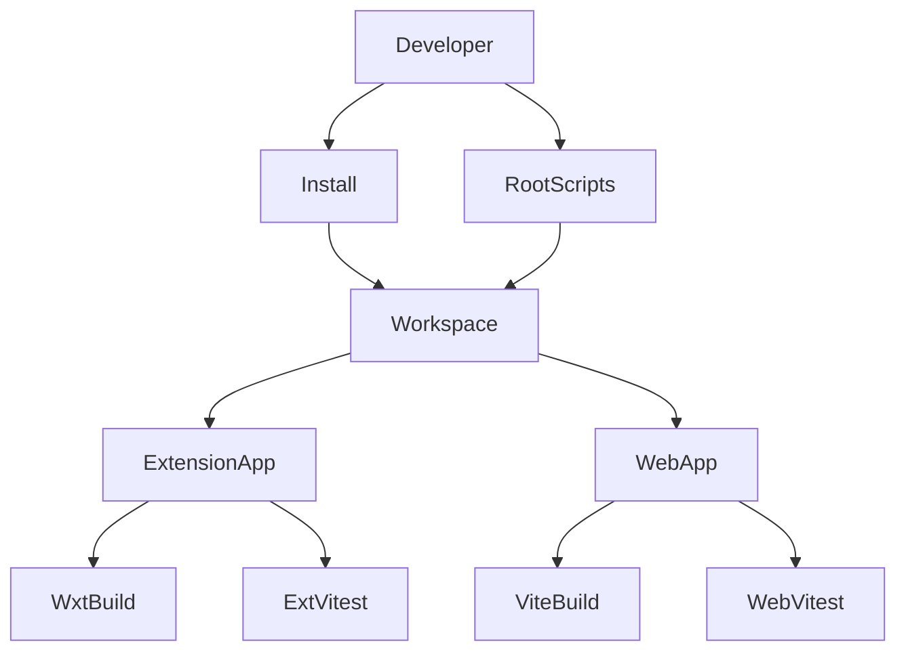

# Design Document: monorepo-setup

## Overview

**Purpose**: site-blocker の開発者に、拡張とブロック画面を1つのワークスペースで開発できる土台を提供する。後続 spec（`redirect-rules`、`blocked-page`）が worktree で並行実装を始める前に、リポジトリ直下の設定と2つのアプリの雛形を main 上で確定させる。

**Users**: site-blocker の開発者と、後続 spec を実装する開発者（Claude の実装サブエージェントを含む）。リポジトリ直下からのインストール・ビルド・テストに使う。

**Impact**: 現在コードが存在しないリポジトリに、pnpm workspace と、`apps/extension`（WXT）・`apps/web`（Vite + React）の機能を持たない雛形を追加する。

### Goals
- 1回の `pnpm install` で両アプリの依存が導入され、lockfile から同じ状態を再現できる
- リポジトリ直下から全アプリのビルドとテストを一括実行でき、アプリ単体でも実行できる

### Non-Goals
- ブロック機能（リダイレクトルール）とブロック画面の表示内容
- GitHub Pages へのデプロイ、CI
- lint / format / 型チェックの共通設定と一括実行
- 雛形を Chrome やブラウザで起動して確認すること
- 複数アプリで共有するコードの置き場所（`packages/`）
- Node.js・pnpm のバージョンをインストール時に強制すること（`mise.toml` で管理する）

## Boundary Commitments

### This Spec Owns
- ワークスペース定義: ルートの `package.json`、`pnpm-workspace.yaml`、`pnpm-lock.yaml`
- 一括実行の規約: ルートの `build` / `test` スクリプトと、「各アプリは `build` と `test` スクリプトを持つ」という規約
- アプリの雛形: `apps/extension` と `apps/web` のパッケージ定義、ビルド設定、テスト実行設定、no-op のエントリーポイント
- パッケージ名 `@site-blocker/extension` と `@site-blocker/web`（単体実行時のフィルタ名として使われる）

### Out of Boundary
- `apps/extension/entrypoints/` 配下の機能実装（`redirect-rules`）。本 spec は no-op の `background.ts` を置くだけで、中身の変更は `redirect-rules` が行う
- `apps/web/src/` 配下の表示内容、テスト環境（jsdom 等）の追加（`blocked-page`）
- `.github/workflows/`（デプロイは `blocked-page`、CI は別 spec）
- lint / format / 型チェックの設定、tsconfig の strict などの方針（別 spec）
- `mise.toml` の内容（既存。本 spec では変更しない）

### Allowed Dependencies
- 実行環境: `mise.toml` で固定した Node.js 26.8.2 と pnpm 12.4.1
- 外部ライブラリ: 下記 Technology Stack に列挙したもののみ
- `apps/extension` と `apps/web` は互いに依存しない（`dependencies` にも import にも相手を含めない）

### Revalidation Triggers
- パッケージ名（`@site-blocker/extension`、`@site-blocker/web`）の変更 — 単体実行の手順が変わる
- ルートの `build` / `test` スクリプトや「各アプリは `build` と `test` を持つ」規約の変更 — 後続 spec が追加するスクリプトに影響
- `mise.toml` の Node.js / pnpm のメジャー更新 — 依存ライブラリの engines との互換を見直す
- Vite / WXT / Vitest のメジャー更新 — 後続 spec のビルド・テスト設定に影響
- ビルド成果物の出力先（`apps/extension/.output/`、`apps/web/dist/`）の変更 — `blocked-page` のデプロイに影響

## Architecture

### Architecture Pattern & Boundary Map



- **Selected pattern**: pnpm workspace + 再帰実行。2アプリの規模ではタスクランナー（Turborepo 等）は過剰で、pnpm の `-r` と `--filter` で要件を満たす
- **Domain boundaries**: ルートはワークスペースの定義と一括実行の入口だけを持ち、アプリ固有のコードを持たない。各アプリは自分のビルド・テスト設定を持つ
- **Steering compliance**: `apps/<name>/` にデプロイ単位を並べ、直下には設定だけを置く（guide-structure）。拡張と Web を疎結合に保つ（guide-tech）

### Technology Stack

| Layer | Choice / Version | Role in Feature | Notes |
| --- | --- | --- | --- |
| Runtime | Node.js 26.8.2 | 全スクリプトの実行 | `mise.toml` で固定 |
| Package manager | pnpm 12.4.1 | workspace、再帰実行、lockfile | `mise.toml` で固定 |
| Extension build | WXT 0.21.4 | 拡張のビルドと型生成（`wxt prepare`） | Manifest V3、出力 `.output/chrome-mv3/` |
| Web build | Vite 8.3.0 + @vitejs/plugin-react 6.1.1 | ブロック画面のビルド | 出力 `dist/` |
| UI | React 19.3.0 / react-dom 19.3.0 | ブロック画面の雛形 | @types/react・@types/react-dom 19.3.0 |
| Test | Vitest 5.0.0 | 両アプリのテスト実行 | 拡張は `WxtVitest` プラグインを使う |
| Language | TypeScript 7.0.2 | エディタ支援、WXT の型生成 | 型チェックの実行は範囲外 |

- 依存は `^` で指定し（例: `"vite": "^8.3.0"`）、パッチ・マイナーの更新を受け入れる。実際に入るバージョンは `pnpm-lock.yaml` で固定し、更新は `pnpm update` と lockfile のコミットで行う
- 選定の比較と実測結果は `research.md` を参照

## File Structure Plan

### Directory Structure
```
site-blocker/
├── package.json                  # ルート: build / test スクリプト
├── pnpm-workspace.yaml           # ワークスペース対象（apps/*）
├── pnpm-lock.yaml                # 生成物。コミットして再現性を保証する
└── apps/
    ├── extension/
    │   ├── package.json          # @site-blocker/extension。build / test / postinstall
    │   ├── wxt.config.ts         # WXT 設定（空の defineConfig）
    │   ├── tsconfig.json         # .wxt/tsconfig.json を継承
    │   ├── vitest.config.ts      # WxtVitest プラグインの配線
    │   └── entrypoints/
    │       └── background.ts     # no-op の background。WXT のビルドに最低1つ必要
    └── web/
        ├── package.json          # @site-blocker/web。build / test
        ├── vite.config.ts        # React プラグインの配線（Vitest もこの設定を読む）
        ├── tsconfig.json         # JSX とモジュール解決に必要な最小限の設定
        ├── index.html            # マウント先の #root を持つ HTML
        └── src/
            └── main.tsx          # #root に空の React ツリーをマウント
```

### 完成後のディレクトリツリー

本 spec の実装完了時点のリポジトリ全体。凡例: `[新規]` 本 spec で作成、`[変更]` 本 spec で変更、`[生成]` コマンド実行で生成され git 管理外（`.gitignore` 済み）、無印は既存。

```
site-blocker/
├── .claude/
│   ├── rules/
│   │   ├── guide-product.md
│   │   ├── guide-structure.md
│   │   ├── guide-tech.md                 # [変更] Common Commands を追記
│   │   └── rule-git.md                   # コミット・ブランチ・プルリクのルール
│   └── skills/
│       ├── debug/
│       ├── impl/
│       ├── review/
│       ├── spec/                          # SKILL.md と3文書のテンプレート
│       └── verify-completion/
├── .github/
│   └── pull_request_template.md          # プルリクのテンプレート
├── .notes/                               # 個人メモ（git 管理外）
├── apps/
│   ├── extension/                        # [新規]
│   │   ├── .output/                      # [生成] wxt build の成果物
│   │   │   └── chrome-mv3/
│   │   │       ├── manifest.json
│   │   │       └── background.js
│   │   ├── .wxt/                         # [生成] wxt prepare の型定義・tsconfig
│   │   ├── entrypoints/
│   │   │   └── background.ts             # [新規] no-op の background
│   │   ├── node_modules/                 # [生成]
│   │   ├── package.json                  # [新規]
│   │   ├── tsconfig.json                 # [新規]
│   │   ├── vitest.config.ts              # [新規]
│   │   └── wxt.config.ts                 # [新規]
│   └── web/                              # [新規]
│       ├── dist/                         # [生成] vite build の成果物
│       │   ├── assets/
│       │   └── index.html
│       ├── node_modules/                 # [生成]
│       ├── src/
│       │   └── main.tsx                  # [新規]
│       ├── index.html                    # [新規]
│       ├── package.json                  # [新規]
│       ├── tsconfig.json                 # [新規]
│       └── vite.config.ts                # [新規]
├── docs/
│   ├── specs/
│   │   └── monorepo-setup/               # 本 spec
│   │       ├── requirements.md
│   │       ├── research.md
│   │       ├── design.md
│   │       └── tasks.md
│   └── guide-workflow.md                 # 開発手順
├── node_modules/                         # [生成]
├── .gitignore
├── CLAUDE.md
├── README.md
├── mise.toml                             # Node.js / pnpm のバージョン固定
├── package.json                          # [新規]
├── pnpm-lock.yaml                        # [新規] pnpm install で生成し、コミットする
└── pnpm-workspace.yaml                   # [新規]
```

### Modified Files
- `.claude/rules/guide-tech.md` — Common Commands に `pnpm build` / `pnpm test` / `pnpm --filter <name> run <script>` を追記する
- `.gitignore` — 変更なし（`node_modules/`、`.output/`、`.wxt/`、`dist/` は既に含まれている）

## Requirements Traceability

| Requirement | Summary | Components | Interfaces | Flows |
| --- | --- | --- | --- | --- |
| 1.1 | 2アプリを独立パッケージとして含む | WorkspaceRoot, ExtensionScaffold, WebScaffold | `pnpm-workspace.yaml` の `apps/*` | — |
| 1.2 | 1回の操作で両アプリの依存を導入 | WorkspaceRoot | `pnpm install` | — |
| 1.3 | 再インストールで同じ状態を再現 | WorkspaceRoot | コミットした `pnpm-lock.yaml`、`pnpm install --frozen-lockfile` | — |
| 2.1 | 拡張の雛形はブロック機能を含まない | ExtensionScaffold | no-op の `background.ts` | — |
| 2.2 | ブロック画面の雛形は表示内容を含まない | WebScaffold | 空の React ツリー | — |
| 2.3 | 雛形は相手のコードに依存しない | ExtensionScaffold, WebScaffold | 相互の依存・import を持たない | — |
| 3.1 | 全アプリをビルドし成果物を出力 | WorkspaceRoot, ExtensionScaffold, WebScaffold | ルート `build`、各アプリ `build` | — |
| 3.2 | 雛形のみでエラーなくビルド | ExtensionScaffold, WebScaffold | 同上 | — |
| 3.3 | ビルド失敗時に全体を失敗させ対象を表示 | WorkspaceRoot | `pnpm -r run build` の失敗伝播 | — |
| 3.4 | 指定アプリだけビルド | WorkspaceRoot | `pnpm --filter <name> run build` | — |
| 4.1 | 全アプリのテストを実行し結果を表示 | WorkspaceRoot, ExtensionScaffold, WebScaffold | ルート `test`、各アプリ `test` | — |
| 4.2 | テスト0件でも失敗にしない | ExtensionScaffold, WebScaffold | `vitest run --passWithNoTests` | — |
| 4.3 | テスト失敗時に全体を失敗させ対象を表示 | WorkspaceRoot | `pnpm -r run test` の失敗伝播、Vitest の報告 | — |
| 4.4 | 指定アプリのテストだけ実行 | WorkspaceRoot | `pnpm --filter <name> run test` | — |

## Components and Interfaces

| Component | Domain/Layer | Intent | Req Coverage | Key Dependencies | Contracts |
| --- | --- | --- | --- | --- | --- |
| WorkspaceRoot | Root | ワークスペース定義と一括実行 | 1.1, 1.2, 1.3, 3.1, 3.3, 3.4, 4.1, 4.3, 4.4 | pnpm 12 (P0) | Batch |
| ExtensionScaffold | apps/extension | 機能を持たない拡張の雛形 | 1.1, 2.1, 2.3, 3.1, 3.2, 4.1, 4.2 | WXT (P0), Vitest (P0) | Batch |
| WebScaffold | apps/web | 表示内容を持たないブロック画面の雛形 | 1.1, 2.2, 2.3, 3.1, 3.2, 4.1, 4.2 | Vite (P0), React (P0), Vitest (P0) | Batch |

### Root

#### WorkspaceRoot

| Field | Detail |
| --- | --- |
| Intent | 2アプリをワークスペースにまとめ、インストール・ビルド・テストの入口を提供する |
| Requirements | 1.1, 1.2, 1.3, 3.1, 3.3, 3.4, 4.1, 4.3, 4.4 |

**Responsibilities & Constraints**
- `pnpm-workspace.yaml` は `apps/*` のみを対象にする
- ルート `package.json` は `name: "site-blocker"`、`private: true`、`type: "module"` とし、アプリの依存を持たない
- `pnpm-lock.yaml` をコミットし、`pnpm install --frozen-lockfile` で再現できる状態を保つ

**Dependencies**
- External: pnpm 12.4.1 — workspace、再帰実行、lockfile (P0)
- Outbound: ExtensionScaffold / WebScaffold — 各アプリの `build` / `test` スクリプト (P0)

**Contracts**: Batch [x]

##### Batch / Job Contract
| コマンド（リポジトリ直下） | 実体 | 成功条件 | 失敗時 |
| --- | --- | --- | --- |
| `pnpm install` | 依存の解決と導入、各 lifecycle script | 終了コード 0 | 終了コード非0、原因を表示 |
| `pnpm install --frozen-lockfile` | lockfile どおりに導入 | lockfile と `package.json` が一致すれば 0 | lockfile の不一致を表示して非0 |
| `pnpm build` | `pnpm -r run build` | 全アプリの `build` が 0 | 最初の失敗で停止し、失敗したアプリのパスを表示して非0 |
| `pnpm test` | `pnpm -r run test` | 全アプリの `test` が 0 | 同上 |
| `pnpm --filter <name> run <build\|test>` | 指定アプリのスクリプト | 指定アプリのみ実行して 0 | 指定アプリの失敗を表示して非0 |

- `<name>` は `@site-blocker/extension` または `@site-blocker/web`
- ルート `package.json` の `scripts`:
  ```json
  {
    "build": "pnpm -r run build",
    "test": "pnpm -r run test"
  }
  ```

**Implementation Notes**
- Validation: 並行実行中の他アプリも `Failed` と表示される場合があるため、最後の `ERR_PNPM_RECURSIVE_RUN_FIRST_FAIL` が実際に失敗したアプリを指すことを確認する

### Apps

#### ExtensionScaffold

| Field | Detail |
| --- | --- |
| Intent | ブロック機能を持たず、ビルドとテストが通る WXT 拡張の雛形 |
| Requirements | 1.1, 2.1, 2.3, 3.1, 3.2, 4.1, 4.2 |

**Responsibilities & Constraints**
- `package.json`: `name: "@site-blocker/extension"`、`version: "0.0.0"`（WXT の manifest version 警告を防ぐ）、`private: true`、`type: "module"`
- `scripts`: `build: "wxt build"`、`test: "vitest run --passWithNoTests"`、`postinstall: "wxt prepare"`
- `devDependencies`: `wxt`、`vitest`、`typescript`（`^` 指定）
- `entrypoints/background.ts` は `export default defineBackground(() => {});` のみ。WXT はエントリーポイントが1つもないと `wxt prepare` とビルドが失敗するため必須
- `vitest.config.ts` は `WxtVitest()` を登録し、後続のテストが `browser` API（fake browser）と WXT の自動 import を使えるようにする
- `tsconfig.json` は `.wxt/tsconfig.json` を継承するだけ
- 成果物: `.output/chrome-mv3/`

**Dependencies**
- External: WXT 0.21.4 — ビルド、型生成 (P0)
- External: Vitest 5.0.0 — テスト実行 (P0)

**Contracts**: Batch [x]（WorkspaceRoot の Batch Contract に従う `build` / `test` スクリプト）

**Implementation Notes**
- Integration: `redirect-rules` は `entrypoints/background.ts` の中身を実装し、テストを追加する。`vitest.config.ts` と `package.json` のスクリプト名は変えない
- Risks: TypeScript 7.0.2 は新しいメジャー版。試作では `wxt prepare` の型生成が成功している

#### WebScaffold

| Field | Detail |
| --- | --- |
| Intent | 表示内容を持たず、ビルドとテストが通る Vite + React の雛形 |
| Requirements | 1.1, 2.2, 2.3, 3.1, 3.2, 4.1, 4.2 |

**Responsibilities & Constraints**
- `package.json`: `name: "@site-blocker/web"`、`private: true`、`type: "module"`
- `scripts`: `build: "vite build"`、`test: "vitest run --passWithNoTests"`
- `dependencies`: `react`、`react-dom`。`devDependencies`: `vite`、`@vitejs/plugin-react`、`vitest`、`typescript`、`@types/react`、`@types/react-dom`（`^` 指定）
- `index.html` は `<div id="root"></div>` と `src/main.tsx` の読み込みのみ
- `src/main.tsx` は `#root` に空の React ツリー（`<StrictMode />`）をマウントするだけで、表示内容を持たない
- `vite.config.ts` は `@vitejs/plugin-react` のみを登録する。Vitest はこの設定を読むため、テスト用の設定ファイルは置かない
- `tsconfig.json` は `jsx: "react-jsx"`、`module: "ESNext"`、`moduleResolution: "bundler"`、`target: "ES2022"`、`include: ["src"]` のみ。strict などの型チェック方針は別 spec で追加する
- 成果物: `dist/`

**Dependencies**
- External: Vite 8.3.0、@vitejs/plugin-react 6.1.1 — ビルド (P0)
- External: React 19.3.0 — UI (P0)
- External: Vitest 5.0.0 — テスト実行 (P0)

**Contracts**: Batch [x]（WorkspaceRoot の Batch Contract に従う `build` / `test` スクリプト）

**Implementation Notes**
- Integration: `blocked-page` は `src/` に表示内容とテストを追加し、必要ならテスト環境（jsdom 等）を追加する。GitHub Pages 向けの `base` 設定も `blocked-page` が行う

## Error Handling

### Error Strategy
- すべての失敗は終了コード非0で呼び出し元に伝える。途中で握りつぶさない

### Error Categories and Responses
| 状況 | 検出箇所 | 利用者に見えるもの |
| --- | --- | --- |
| lockfile の不一致 | `pnpm install --frozen-lockfile` | lockfile が最新でない旨 |
| エントリーポイントの欠落 | `wxt prepare` | `No entrypoints found`（雛形では発生しない） |
| いずれかのアプリのビルド失敗 | `pnpm -r run build` | ツールのエラーと `ERR_PNPM_RECURSIVE_RUN_FIRST_FAIL`（失敗アプリのパス） |
| いずれかのテスト失敗 | `pnpm -r run test` | Vitest のファイル名・テスト名・行番号と、失敗アプリのパス |

## Testing Strategy

本 spec の成果物は設定と雛形で、アプリのロジックを持たない。検証はリポジトリ直下でコマンドを実行し、終了コードと出力を確認する形で行う。

### ワークスペースと再現性（1.1, 1.2, 1.3, 2.3）
- `pnpm install` 後、`pnpm -r ls --depth -1` に `@site-blocker/extension` と `@site-blocker/web` が表示される
- `node_modules` を削除して `pnpm install --frozen-lockfile` が終了コード 0 になる
- 両アプリの `package.json` と import に相手のパッケージが含まれない

### 一括ビルド（2.1, 2.2, 3.1, 3.2, 3.3, 3.4）
- `pnpm build` が終了コード 0 で、`apps/extension/.output/chrome-mv3/manifest.json` と `apps/web/dist/index.html` が生成される
- 生成された manifest に、リダイレクトルールや `declarativeNetRequest` の権限が含まれない
- 一時的に `apps/web` に構文エラーを入れた `pnpm build` が終了コード非0で、エラー出力が `apps/web` を示す
- `pnpm --filter @site-blocker/web run build` で `apps/web` だけがビルドされる

### 一括テスト（4.1, 4.2, 4.3, 4.4）
- テストが1つもない状態で `pnpm test` が終了コード 0
- 一時的に失敗するテストを `apps/web` に置いた `pnpm test` が終了コード非0で、テストファイル名と `apps/web` が表示される
- 一時的に `browser.storage` を使うテストを `apps/extension` に置き、`pnpm --filter @site-blocker/extension run test` で拡張のテストだけが実行され成功する
