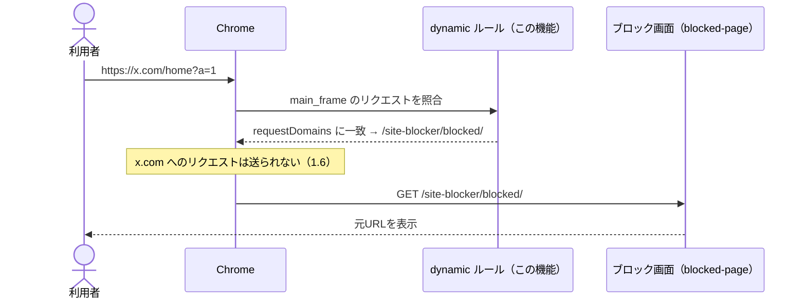
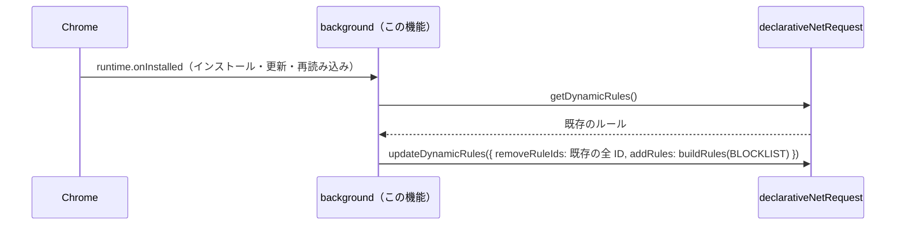

# 設計: redirect-rules

## 方針

ブロックリスト（`x.com`・`twitter.com`）を定数で持ち、そこから `declarativeNetRequest` の dynamic ルールを1サイト1ルールで組み立てる。
background の `runtime.onInstalled`（インストール・更新・再読み込み）で、既存の dynamic ルールをすべて外してから組み立てたルールを入れ直す。
ルールは `requestDomains` でサイトとサブドメインに一致させ、`regexSubstitution` で元URL全体を `#` の後ろに置いてブロック画面へ飛ばす。
権限は `declarativeNetRequestWithHostAccess` と、ブロックリストから生成した `host_permissions` だけにする。
回帰は Playwright で拡張を読み込んだ Chromium を起動し、外部への通信をすべて手元の応答に差し替えて確かめる。

## 決定と理由

| 決定 | 理由 | 却下した案 | 変えるときの影響 |
| ---- | ---- | ---------- | ---------------- |
| リダイレクト先は `https://yoshipon-tech.github.io/site-blocker/blocked/#\0`（`regexSubstitution`）。`regexFilter` は `^.+$` | `guide-tech.md` の URL の契約どおり。実ブラウザで確かめると、`\0` は元URLのパス・クエリ・フラグメントまで含み、`&` `?` `#` `%XX` をエンコードし直さずに渡した（2.2 / 2.3、#7。2026-09-24 に最小の拡張で確認） | `?from=\0`: 置換結果がエンコードされず `&` `#` で壊れる（`guide-tech.md`） | **配布した拡張に焼き込まれる契約。** 変えると、古い拡張が古い URL を指し続ける |
| 権限は `declarativeNetRequestWithHostAccess`。`host_permissions` はブロックリストから `*://*.<ドメイン>/*` を生成する（`*.x.com` は `x.com` 自身も含む） | redirect はリクエスト先へのホスト権限が要る。`main_frame` の遷移では遷移元（initiator）の権限は要らない（[Chrome の declarativeNetRequest ドキュメント](https://developer.chrome.com/docs/extensions/reference/api/declarativeNetRequest)）。実ブラウザでも、権限のない別オリジンのページからのリンクでリダイレクトされた。`WithHostAccess` 自体は警告を出さないので、警告がブロックリストのサイトのデータ読み書きだけになる（4.1、U3、#6） | `declarativeNetRequest`: redirect にはどのみちホスト権限が要るうえ、「すべてのページのコンテンツをブロック」の警告が増える / `<all_urls>`: U3 で不採用 | #11 で利用者がサイトを足すときは `optional_host_permissions` と `permissions.request` で1サイトずつ許可を得る。権限の種類を変えると、配布済み拡張の更新時に再承認が要る場合がある |
| 1サイト1ルール。ルール ID はブロックリストの並び順で `1..n`。条件は `requestDomains: [<ドメイン>]`・`resourceTypes: ["main_frame"]` | `requestDomains` はサブドメインにも一致し、`notx.com` や `x.com.example.test` には一致しない（1.2 / 1.3、U1）。`main_frame` のみなので画像・スクリプト・iframe は対象外（1.4）。サイトごとに分けておくと、一時解除（#14）でサイト単位に外せる | 全サイトを1ルールにまとめる: #14 でサイト単位に外せない / `urlFilter` の `||x.com`: 置換（`\0`）には `regexFilter` が要る | ID の振り方は #10 で storage に移すときに見直す（並び順が変わると ID が変わる） |
| 登録は `runtime.onInstalled` で「既存の dynamic ルールを全部外す → 組み立てたルールを入れる」を1回の `updateDynamicRules` で行う | dynamic ルールはブラウザの再起動と拡張の更新をまたいで残る（同ドキュメント）。インストール・更新・再読み込みはどれも `onInstalled` が発火するので、ここで入れ直せばリストの変更が反映され（3.3）、重複もしない（3.4）。再起動では何もしなくても残る（3.2） | `onStartup` でも入れ直す: 残っているので不要 / static ルールセット（manifest）: 実行時に書き換えられず、`guide-tech.md` の「dynamic ルール」の方針と #10 以降に合わない | #10 で storage に移したら、storage の変更時にも同じ関数を呼ぶ |
| ルールの組み立て（`buildRules`）と入れ直し（`syncRules`）は、`chrome` を直接触らない純粋な関数にし、`declarativeNetRequest` を引数で受け取る | Vitest で `chrome` なしに、ID・条件・置換・古いルールの除去を確かめられる | background に直書き: 単体テストできない | なし |
| E2E は `@playwright/test` を `apps/extension` に入れ、`chromium.launchPersistentContext`（`channel: "chromium"`、`--load-extension`）でビルド済みの拡張を読み込む。`context.route` でブロック画面・ブロックリストのサイト・ほかのサイトへの通信をすべて手元の応答に差し替える。スクリプトは `test:e2e`（`wxt build && playwright test`）として `test` と分ける | 拡張は永続コンテキストでしか動かず、ヘッドレスでは `chromium` チャンネルが要る（[Playwright のドキュメント](https://playwright.dev/docs/chrome-extensions)）。外部に接続しないので結果が安定する（6.2）。`test` と分けるのは `blocked-page` と同じ理由（ブラウザのない環境でも `pnpm check` が通る） | 実サイトに接続する: ネットワークと公開中の画面に依存する / `test` に含める: 一括チェックにブラウザが必須になる | E2E を増やすとローカルの確認が遅くなる |
| 開発用に `dev`（`wxt`）を足し、`web-ext` を devDependency に入れる | WXT の開発サーバーが拡張を読み込んだ Chrome を起動し、変更を再ビルドして反映する（5.1）。WXT 0.21 では `web-ext` が任意の peer dependency で、入っていないと Chrome を起動せず手動での読み込みを求める（実装時に判明） | なし | なし |

## 構成

### 影響範囲

```
site-blocker/
├── pnpm-lock.yaml                     変更
└── apps/extension/
    ├── package.json                   変更（dev / test:e2e、@playwright/test・@types/node・web-ext）
    ├── tsconfig.json                  変更（e2e/ と playwright.config.ts を外す）
    ├── wxt.config.ts                  変更（manifest の権限）
    ├── vitest.config.ts               変更（対象を utils/ に絞る）
    ├── entrypoints/background.ts      変更
    ├── utils/blocklist.ts             新規
    ├── utils/rules.ts                 新規
    ├── utils/rules.test.ts            新規
    ├── playwright.config.ts           新規
    └── e2e/redirect.spec.ts, fixtures.ts, tsconfig.json  新規
```

### ファイルと責務

| ファイル（`apps/extension/` から） | 新規/変更 | 責務 |
| -------- | --------- | ---- |
| `utils/blocklist.ts` | 新規 | `BLOCKLIST = ["x.com", "twitter.com"]` と、ブロック画面の URL の定数 |
| `utils/rules.ts` | 新規 | `buildRules(blocklist)`: dynamic ルールの配列を返す。`syncRules(dnr, blocklist)`: 既存を全部外して入れ直す。`hostPermissions(blocklist)`: `*://*.<ドメイン>/*` の配列 |
| `utils/rules.test.ts` | 新規 | 上の3関数の単体テスト（`dnr` は手で作った偽物） |
| `entrypoints/background.ts` | 変更 | `browser.runtime.onInstalled` で `syncRules(browser.declarativeNetRequest, BLOCKLIST)` |
| `wxt.config.ts` | 変更 | `manifest.permissions: ["declarativeNetRequestWithHostAccess"]`、`host_permissions: hostPermissions(BLOCKLIST)` |
| `playwright.config.ts` | 新規 | Chromium のみ、`testDir: "e2e"` |
| `e2e/fixtures.ts` | 新規 | 拡張を読み込んだ永続コンテキストを起動し、通信を手元の応答に差し替え、ルールの登録を待つ |
| `e2e/redirect.spec.ts` | 新規 | 1.x・2.x・3.2・3.4 を確かめる |
| `e2e/tsconfig.json` | 新規 | Playwright の型が要る Node の型を e2e だけに入れる（`blocked-page` と同じ構成） |

## シーケンス

### ブロックする



### ルールを入れ直す



## 他機能との境界

- `blocked-page`: 共有するのは URL の契約（`https://yoshipon-tech.github.io/site-blocker/blocked/#<元URL>`）だけ。E2E ではブロック画面を手元の応答に差し替え、公開中の画面に依存しない
- `blocklist-storage`（#10）: `BLOCKLIST` 定数を storage に置き換え、`syncRules` を storage の変更時にも呼ぶ。`syncRules` は `blocklist` を引数で受けるので、そのまま使える
- `blocklist-ui`（#11）: 追加したサイトの権限は `optional_host_permissions`（`*://*/*`）と `permissions.request` で、追加のたびに許可を得る前提（U3）
- `temporary-unblock-extension`（#14）: 1サイト1ルールなので、サイト単位でルールを外せる

## 検証方法

| 要件 | 検証手段 | 内容 |
| ---- | -------- | ---- |
| 1.1 / 1.5 / 2.1 | Playwright | `https://x.com/home`・`http://twitter.com/` を開くと、URL が `https://yoshipon-tech.github.io/site-blocker/blocked/#<元URL>` になる |
| 1.2 | Playwright | `https://www.x.com/`・`https://mobile.twitter.com/` もブロック画面になる |
| 1.3 | Playwright | `https://example.com/`・`https://notx.com/`・`https://x.com.example.test/` は URL が変わらない |
| 1.4 | Playwright | 手元の応答で返した `https://example.com/` のページが `https://x.com/a.png` を読み込んでも、ページの URL が変わらない |
| 1.6 | Playwright | `https://x.com/**` への `route` が一度も呼ばれない |
| 2.2 / 2.3 | Playwright | `https://x.com/search?q=a&b=%E6%97%A5#frag` の遷移先のフラグメントが `#https://x.com/search?q=a&b=%E6%97%A5#frag` と一致する |
| 3.1〜3.4 | コマンド | 単体テスト: `buildRules` の ID・条件・置換、`syncRules` が既存の全 ID を外して入れる（リストから外したサイトのルールが残らない） |
| 3.2 / 3.4 | Playwright | 同じプロファイルで起動し直しても、ルールが2件のままで x.com がブロックされる |
| 4.1 | コマンド | ビルドした `manifest.json` の `permissions` が `declarativeNetRequestWithHostAccess` のみ、`host_permissions` が `*://*.x.com/*` と `*://*.twitter.com/*` のみ |
| 5.1 | ブラウザ | `pnpm --filter @site-blocker/extension run dev` で Chrome が起動し、x.com を開くとブロック画面になる。ソースを変えると再読み込みされる |
| 1.x（実挙動） | ブラウザ | ビルドした拡張を chrome-devtools MCP の `install_extension` で読み込み、公開中のブロック画面に元URLが出ることを確かめる |
| 6.1 | コマンド | `buildRules` の置換を一時的に壊すと `test:e2e` が失敗し、戻すと通る |

## リスク

- Playwright の `route` が、拡張のリダイレクトより前に x.com へのリクエストを横取りする — 横取りされると 1.1 が確かめられない。そのときは x.com の `route` を外し、`page.on("request")` で x.com への送信がないことを見る
- `http://twitter.com/` が HTTPS への自動切り替えで先に `https://` になる — どちらでもブロックされれば 1.5 は満たす。元URLの表記が `https://` になるなら、テストの期待値をそれに合わせる
- WXT の `utils/` の自動 import が、Vitest や型チェックで解決されない — 解決されなければ明示的に import する
- ヘッドレスの `chromium` チャンネルがないと E2E が動かない — `blocked-page` で入れた Chromium（headless shell）とは別に、`playwright install chromium` で入る本体が要る場合がある。`guide-tech.md` の導入手順に足す
