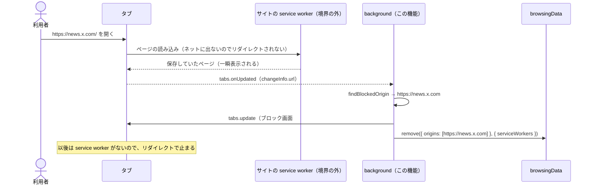

# 設計: service-worker-cleanup

## 方針

ブロックリストのサイトの service worker を `browsingData.remove` で取り除き、ページの読み込みを今の `declarativeNetRequest` のリダイレクトに戻す。
取り除くのは2通り。インストール・更新・起動・保存内容の変更のたびに、各サイトの本体と `www.`・`m.`・`mobile.` を先に取り除く（1.4）。
それでも残っていた service worker がページを表示したら、`tabs.onUpdated` で気づいてブロック画面へ移し、そのオリジンも取り除く（1.6）。
オリジンの組み立てと URL の判定は `chrome` を触らない関数にし、Vitest で確かめる。挙動は Playwright でテスト用の service worker を登録して回帰させる。

## 決定と理由

| 決定 | 理由 | 却下した案 | 変えるときの影響 |
| ---- | ---- | ---------- | ---------------- |
| `browsingData.remove({ origins }, { serviceWorkers: true })` で取り除く。消すのは service worker だけ | `origins` で消す範囲を絞れるのは cookies・storage・cache で、service worker は storage に含まれる（[browsingData](https://developer.chrome.com/docs/extensions/reference/api/browsingData)）。Cookie を選ばないのでログイン状態は残る（2.1）。指定したオリジン以外には触れない（2.2）。登録がないオリジンを指定してもエラーにならない（2.3、実装時に確かめる） | すべての service worker を消す: ほかのサイトの通知やオフライン動作が壊れる（2.2） / Cookie も消す: ログアウトさせる | 消す種類を増やすと、ブロックリストのサイトのログイン状態などに影響する |
| 先に取り除くオリジンは `https://<ドメイン>`・`https://www.`・`https://m.`・`https://mobile.` の4つ。`http` は含めない | `origins` は完全一致でしか指定できない（同ドキュメント）。service worker は安全なオリジン（https）にしか登録されない。4つで x.com・twitter.com・youtube.com の実際の登録先を覆う（U1） | サブドメインを列挙する API: 存在しない / 4つより増やす: 当たらないオリジンを毎回消すだけで、取りこぼしは 1.6 で拾う | 前置きを増やすときは `serviceWorkerOrigins` だけ変える |
| 先に取り除くきっかけは `runtime.onInstalled`・`runtime.onStartup`・`blocklistItem.watch`（ルールの入れ直しと同じ3つ）。毎回、保存内容のすべてのドメインを対象にする | 1.1〜1.3 のきっかけと一致する。足したサイトだけを差分で求めなくても、取り除く操作は何度呼んでも結果が同じ | 足したサイトだけ取り除く: 差分の計算が増える。外したサイトを対象にしても害はないが、ブロックしないサイトのデータに触れることになるので、対象は保存内容の有効なドメインに限る | #12 は時間帯の始まりに同じ関数を呼ぶ |
| 残っていた service worker には `tabs.onUpdated` の `changeInfo.url` で気づく。ホストがブロックリストのドメインかそのサブドメインなら、`tabs.update` でブロック画面（`BLOCKED_PAGE_URL#<元URL>`）へ移し、並行してそのオリジンを取り除く | ブロック中のサイトの URL がタブに入るのは、リダイレクトをすり抜けたときだけ。`changeInfo.url` は、`tabs` 権限がなくてもホスト権限を持つページなら得られ、`tabs.update` は権限が要らない（[tabs](https://developer.chrome.com/docs/extensions/reference/api/tabs)）。ブロック対象のサイトにはホスト権限があるので、権限を増やさない（3.1）。移す先の URL は `redirect-rules` の契約と同じ形 | `webNavigation`: 「閲覧履歴の読み取り」の警告が出る（3.1） / content script で移す: #30 で不採用 / 取り除いてから再読み込み: サイトへのリクエストを待つ分だけ遅く、`tabs.update` で足りる | ブロック画面の URL の契約を変えるときは、ここも同時に変える（`guide-tech.md`） |
| 権限は `browsingData` を足す | インストール時の警告がない（[権限の一覧](https://developer.chrome.com/docs/extensions/reference/permissions-list)、3.1） | なし | なし。警告がないので、配布済み拡張の更新で再承認は要らない |
| E2E では、ブロックしていない間にテスト用のページから service worker（自前で応答を返す `fetch` ハンドラ）を登録し、その後にブロックリストへ足して確かめる。service worker が返すページは、手元の応答に差し替えた別の URL へ1回リクエストを送り、ページが表示されたかを記録する | 実在のサイトに接続せずに #30 の現象を再現できる（4.2）。Chromium では `context.route` が service worker のスクリプトの取得も差し替える（[Playwright: Service Workers](https://playwright.dev/docs/service-workers)、[playwright#38642](https://github.com/microsoft/playwright/issues/38642)）。記録のリクエストで「中身が表示されたか」を判定できる（1.5 / 1.6） | 実在の x.com で確かめる: ネットワークとログインに依存する | なし |

## 構成

### 影響範囲

```
site-blocker/apps/extension/
├── wxt.config.ts                    変更（browsingData 権限）
├── entrypoints/background.ts        変更（取り除くきっかけと tabs.onUpdated）
├── utils/service-worker.ts          新規
├── utils/service-worker.test.ts     新規
├── tests/background.test.ts         変更
└── e2e/
    ├── fixtures.ts                  変更（テスト用 service worker の応答）
    └── service-worker.spec.ts       新規
```

### ファイルと責務

| ファイル（`apps/extension/` から） | 新規/変更 | 責務 |
| -------- | --------- | ---- |
| `utils/service-worker.ts` | 新規 | `serviceWorkerOrigins(domains)` → 先に取り除くオリジンの配列。`findBlockedOrigin(url, domains)` → URL のホストがドメインかそのサブドメインなら、その https オリジン（それ以外は `null`）。`clearServiceWorkers(browsingData, origins)` → `browsingData.remove` を1回呼ぶ（空なら呼ばない） |
| `utils/service-worker.test.ts` | 新規 | オリジンの組み立て、サブドメインと名前が似ているだけのホスト（`notx.com`）の判定、`browsingData` に渡す引数（`serviceWorkers` だけ） |
| `entrypoints/background.ts` | 変更 | 3つのきっかけで `parseBlocklist` の有効なドメインから先に取り除く。`tabs.onUpdated` をトップレベルで登録し、ブロック中のサイトの URL ならブロック画面へ移して取り除く。失敗は理由をコンソールに残す |
| `tests/background.test.ts` | 変更 | 3つのきっかけで取り除く処理が呼ばれること、`tabs.onUpdated` でブロック中のサイトの URL のときだけ移すこと |
| `wxt.config.ts` | 変更 | `permissions` に `browsingData` を足す |
| `e2e/fixtures.ts` | 変更 | 指定したホストで、テスト用 service worker を登録するページと、そのスクリプトを返す応答。記録のリクエストを `requests` に残す |
| `e2e/service-worker.spec.ts` | 新規 | 1.x・2.x を、拡張を読み込んだ Chromium で確かめる |

## シーケンス

### 残っていた service worker がページを表示した



インストール・起動・保存内容の変更では、ルールの入れ直しと並んで `clearServiceWorkers(serviceWorkerOrigins(ドメイン))` を呼ぶ。

## 他機能との境界

- `redirect-rules`: リダイレクトのルールと URL の契約は変えない。`tabs.update` の移し先は同じ契約の形（`BLOCKED_PAGE_URL` を使う）
- `blocklist-storage`: 入れ直しの列（`createSync`）には手を入れない。取り除く処理は同じきっかけで別に呼ぶ（何度呼んでも結果が同じなので、列に並べなくてよい）
- `blocklist-ui`: ポップアップは変えない。足したサイトは `blocklistItem.watch` のきっかけで取り除かれる
- `schedule-blocking`（#12）: 時間帯の始まりに `clearServiceWorkers` を呼ぶ。`tabs.onUpdated` で移すのは「今ブロックしているドメイン」に限るので、#12 は判定に渡すドメインを時間帯で絞る

## 検証方法

| 要件 | 検証手段 | 内容 |
| ---- | -------- | ---- |
| 1.1 / 1.3 | コマンド | 単体テスト（`tests/background.test.ts`）: `onStartup`・`onInstalled` で、保存内容のドメインから作ったオリジンを取り除く処理が呼ばれる。取り除く処理そのものは 1.2 の Playwright と同じ関数。E2E では「ブロックリストに入ったまま service worker が残っている」状態を作れない（登録用のページを開くと 1.6 で移され、ブロックリストに足すと 1.2 で取り除かれる。実装時に判明） |
| 1.2 / 1.5 | Playwright | 空のブロックリストで x.com に service worker を登録し、`["x.com"]` を保存すると、x.com がブロック画面に移り記録のリクエストが出ない |
| 1.4 | コマンド | 単体テスト: `serviceWorkerOrigins(["youtube.com"])` が4つの https オリジンになる |
| 1.4 / 1.5 | Playwright | `www.x.com` に登録した service worker も 1.2 と同じく取り除かれる |
| 1.6 | Playwright | `news.x.com` に登録し `["x.com"]` を保存すると、1回目はブロック画面に移り記録のリクエストが1回出て、2回目は記録のリクエストが出ずにブロック画面に移る |
| 1.6 | コマンド | 単体テスト: `findBlockedOrigin` がサブドメインを拾い、`notx.com`・`x.com.example.test`・ブロック画面の URL を拾わない |
| 2.1 | Playwright | x.com の Cookie を入れてから 1.2 を行っても、Cookie が残っている |
| 2.2 | Playwright | example.com に登録した service worker は、1.2 のあとも example.com のページを返す |
| 2.3 | Playwright | service worker を登録していない状態で既存の `redirect.spec.ts`・`storage.spec.ts`・`popup.spec.ts` が変更なしで通り、service worker のコンソールにエラーが出ない |
| 3.1 | コマンド | ビルドした `manifest.json` の `permissions` が `browsingData` だけ増え、`host_permissions`・`optional_host_permissions` が変わらない |
| 4.1 | コマンド | 先に取り除く処理と `tabs.onUpdated` の処理をそれぞれ一時的に外すと、`test:e2e` が失敗し、戻すと通る |
| （実在のサイト） | ブラウザ | 人が手元の Chrome で x.com にログインしてから x.com をブロックリストに足し、x.com がブロック画面に移り、外すとログインしたまま開けることを確かめる |

## リスク

- `context.route` がテスト用 service worker のスクリプトを差し替えられない、または登録した service worker が Playwright の差し替えより先に応答しない — 最初のタスクで現象の再現（拡張なしでもブロックをすり抜ける）を確かめ、できなければ止めて報告する
- `tabs.onUpdated` の `changeInfo.url` が、service worker が返したページで発火しない — 発火しなければ `status: "loading"` の `tab.url` で判定する。それでも取れなければ 1.6 を見直す
- `browsingData.remove` が、登録のないオリジンや存在しないサブドメインでエラーを返す — 返したら、エラーを記録して残りの処理を続ける形にする
